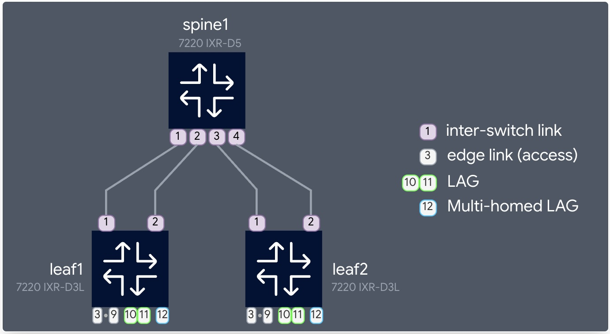
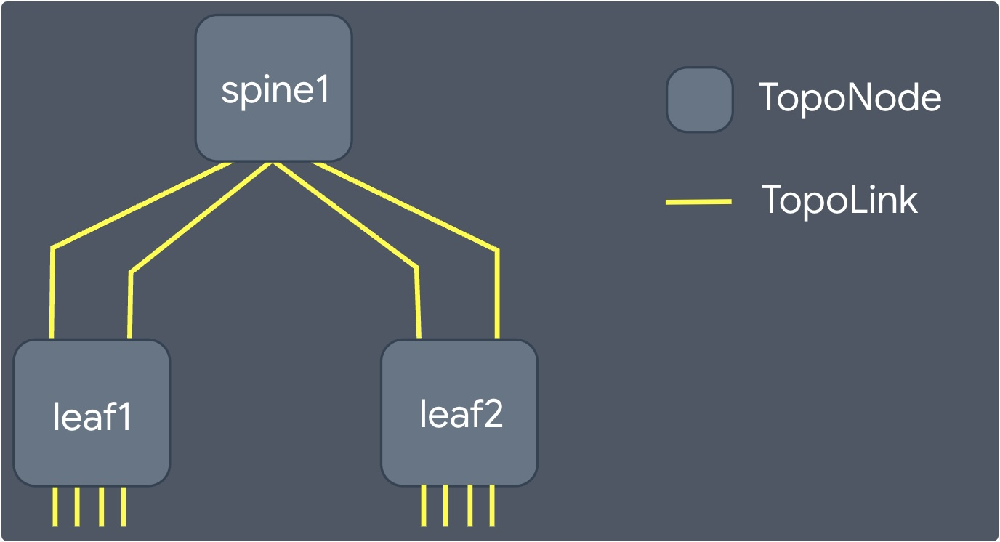
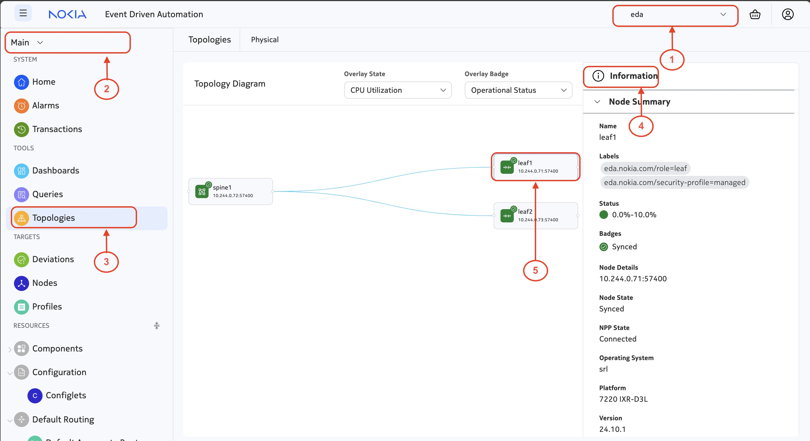

# EDA Workshop 

| Version | 24.12.1 |
| ------- | ------- |

> Join the community on [discord](https://eda.dev/discord)

## Topics:

### Overview

### [Topologies](# Topologies)
 - TopoNodes
 - TopoLinks
 - Topologies
 - Further Reading [docs.eda.dev](https://docs.eda.dev/user-guide/topologies/) and [documentation.nokia.com](https://documentation.nokia.com/eda/24-12/books/user/topologies.html)

### Fabric
 - Building Blocks
 - Manual Configuration
 - Template Deployment
 - Further Reading [docs.eda.dev](https://docs.eda.dev/apps/fabric/)

### Queries
 - EQL 
 - Natural Language
 - edactl
 - e9s
 - Further Reading [docs.eda.dev](https://docs.eda.dev/user-guide/queries/) and [documentation.nokia.com](https://documentation.nokia.com/eda/24-12/books/user/queries.html)

### Day 1+
 - Digital Twin
 - Custom Dashboards [documentation.nokia.com](https://documentation.nokia.com/eda/24-12/books/user/dashboard-designer.html)
 - Deviations & Remediation
 - Revision Control (Restore/Revert)

### Challenge Yourself
 - ZTP
 - Create Custom Dashboard

---

# Overview

> "In the similar spirit of _reducing the barriers_ that we did with SR Linux, we distribute the free EDA version by publishing EDA components in the public container registry. Leaving you no excuses not to try it :brain:" - Roman Dodin

The workshop will primarily focus on getting familiar with the key concepts in EDA. As such, we are not going to spend a lot of time diving deep into the inner workings of EDA. We hope that participating in this workshop will whet your appetite. Since EDA is free (as in :beer:) to try, you can easily spin up your own installation and get as wild as you want!

**When you are ready to spin up your own playground... [Try EDA!](https://docs.eda.dev/getting-started/try-eda/)**

We will be building our fabric and overlay on top of the base topology that is instantiated when you start the Try EDA! Playground, but you are encouraged to get as creative as your computer resources will allow 💻

# Topologies

The topology is the foundation of the layers of abstraction EDA uses to implement the declared intent of the engineer. It is made up of a number of nodes, interfaces and links. 

The default topology in the playground (and the one we are using) is depicted in this image:

In EDA, the topology is a tree made up of nodes and links. Each *tier* of the tree can contain multiple resources and relationships between *tiers* is drawn based on the links 🌲

The playground topology when depicted in this abstracted way looks like this:

You may have noticed that the abstraction image refers to the nodes as TopoNodes and the links as TopoLinks. In EDA, a leaf or spine switch would be a TopoNode and the circuit between the leaf and spine would be a TopoLink.

## :rocket: Activity 

Based on the image above:

1. Click this dropdown to choose the `eda` namespace
2. Click `Main`
3. Click `Topologies`
4. Click the `i` to open this information screen
5. Click `leaf1' to be able to see all of the information about the node, take a moment to look at all of the available information about this node.

## 🏆 Going Deeper

Topologies can be built manually, but it is far more common to generate the topology files using one of the methods described in the [docs.eda.dev](https://docs.eda.dev/user-guide/topologies/#topology-file)

To challenge yourself, draw your topology on a napkin and then use the tools to generate your topology in EDA to match your drawing.
