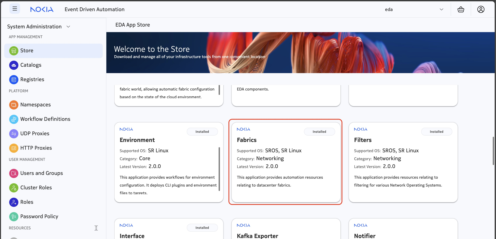
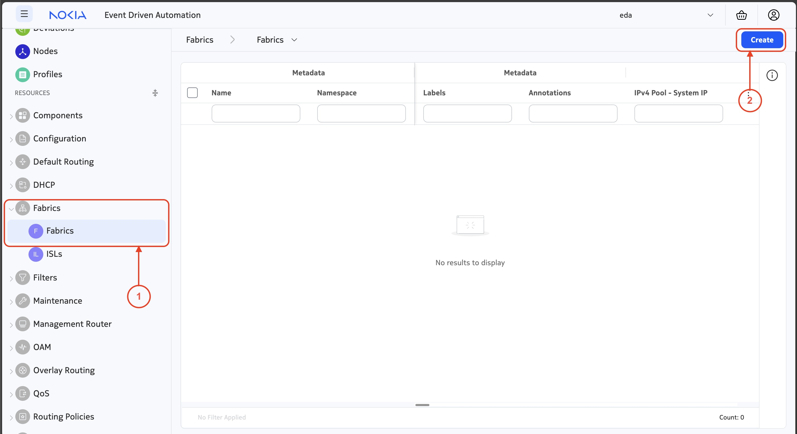
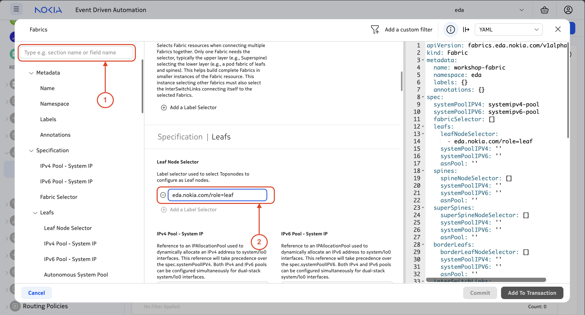
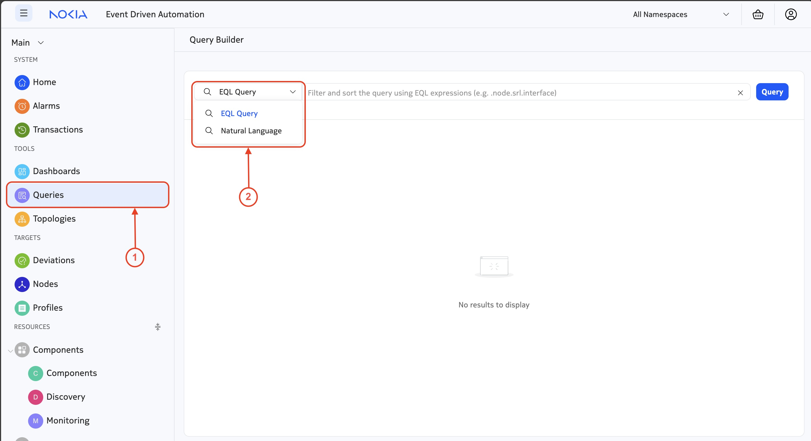
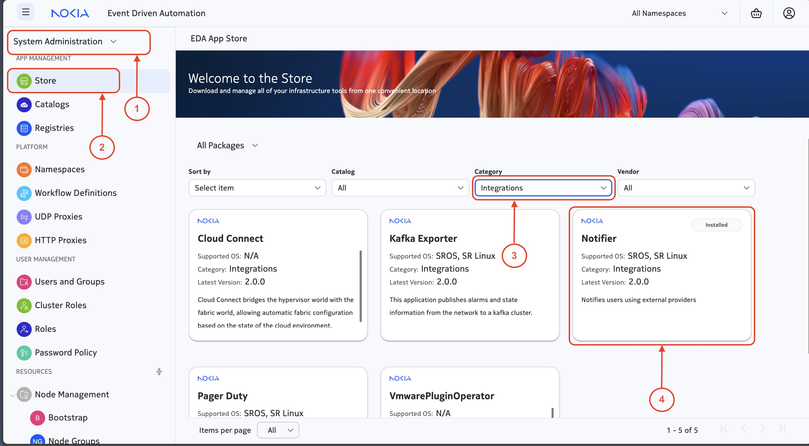
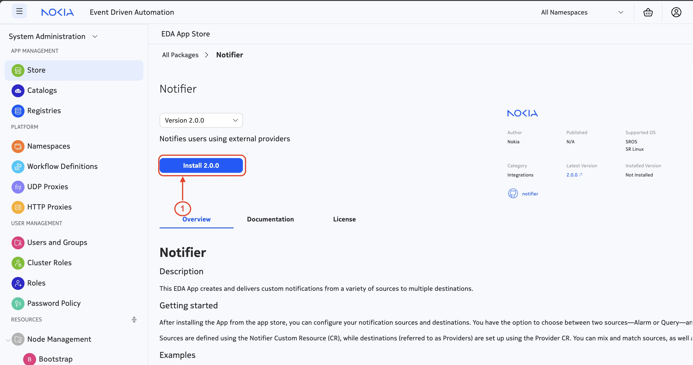
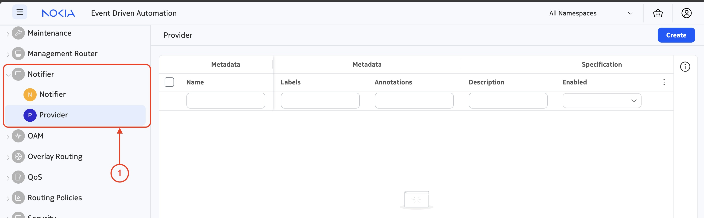

# EDA Workshop 

| Version | 24.12.1 |
| ------- | ------- |

> Join the community on [discord](https://eda.dev/discord)

## Topics:

### Overview

### [Topologies](#topologies-1)
 - TopoNodes
 - TopoLinks
 - Topologies
 - Further Reading [docs.eda.dev](https://docs.eda.dev/user-guide/topologies/) and [documentation.nokia.com](https://documentation.nokia.com/eda/24-12/books/user/topologies.html)
> 🔑 Key Takeaway: The playground operates using the same mechanism that powers digital twin capabilities, enabling you to test and validate any changes before applying them to the physical network.

### [Fabric](#fabric-1)
 - Building Blocks
 - Manual Configuration
 - Template Deployment
 - Further Reading [docs.eda.dev](https://docs.eda.dev/apps/fabric/)
> 🔑 Key Takeaway: The declarative, intent-based approach provided by EDA allows an engineer to validate and implement an entire fabric in less time than it takes an engineer to log into a single switch.

### [Queries](#queries-1)
 - EQL 
 - Natural Language
 - edactl
 - e9s
 - Further Reading [docs.eda.dev](https://docs.eda.dev/user-guide/queries/) and [documentation.nokia.com](https://documentation.nokia.com/eda/24-12/books/user/queries.html)
> 🔑 Key Takeaway: The EQL enables real-time querying and parsing of the entire state of managed devices, supplying data for visualization and streaming to external applications. This gives engineers a unified view of the managed network, treating it as a single cohesive resource.

### [ChatOps](#chatops-1)
 - App Store
 - Notifier
 - Further Reading [docs.eda.com](https://docs.eda.dev/apps/notifier/)
> 🔑 Key Takeaway: Extending the functionality of EDA is just a click away with the App Store. Integrating ChatOps into your operations workflow is just that simple.

### [Custom Dashboard](#custom_dashboard-1)
 - EQL
 - Further Reading [documentation.nokia.com](https://documentation.nokia.com/eda/24-12/books/user/dashboard-designer.html)
> 🔑 Key Takeaway: Creating custom dashboards in EDA allows you to tailor the data to display information important to your organization.

### Challenge Yourself
 - Revision Control (Restore/Revert)
 - Deviations & Remediation

---

# Overview

> "In the similar spirit of _reducing the barriers_ that we did with SR Linux, we distribute the free EDA version by publishing EDA components in the public container registry. Leaving you no excuses not to try it :brain:" - Roman Dodin

The workshop will primarily focus on getting familiar with the key concepts in EDA. As such, we are not going to spend a lot of time diving deep into the inner workings of EDA. We hope that participating in this workshop will whet your appetite. Since EDA is free (as in :beer:) to try, you can easily spin up your own installation and get as wild as you want!

**When you are ready to spin up your own playground... [Try EDA!](https://docs.eda.dev/getting-started/try-eda/)**

We will be building our fabric and overlay on top of the base topology that is instantiated when you start the Try EDA! Playground, but you are encouraged to get as creative as your computer resources will allow 💻

# Topologies

The topology is the foundation of the layers of abstraction EDA uses to implement the declared intent of the engineer. It is made up of a number of nodes, interfaces and links. 

The default topology in the playground (and the one we are using) is depicted in this image:

In EDA, the topology is a tree made up of nodes and links. Each *tier* of the tree can contain multiple resources and relationships between *tiers* is drawn based on the links 🌲

The playground topology when depicted in this abstracted way looks like this:

You may have noticed that the abstraction image refers to the nodes as TopoNodes and the links as TopoLinks. In EDA, a leaf or spine switch would be a TopoNode and the circuit between the leaf and spine would be a TopoLink.

## :rocket: Activity 

Based on the image above:

1. This drop-down allows you to select the `Namespace`, this topology is in the `eda` Namespace
2. The topology is found in the `Main` screen
3. `Topologies` are where we can find defined topologies (note that you will need to double-click the topology to open the visualization)
4. The `i` opens the `Information` screen.
5. Click `leaf1` to be able to see all of the information about the node, take a moment to look at all of the available information about this node.

Next, look through the options on the left side of the screen to find `Nodes` in the `Targets` subsection.

1. You will see a list of the three nodes in our topology [ spine, leaf1, leaf2 ]
2. Click on the three vertical dots on the far right-hand side of one of the nodes.
3. Click `Node Configuration` to see the full configuration of the node as it is currently deployed. You will be able to come back to look at this after other steps to be able to see how the configuration changes as you build out the fabric. Close this view when you are done.
4. Now click `Configuration View` from the three vertical dots. This is where the various options were set for this node.
5. Click `Edit` in the bottom right corner of the `Configuration View` and notice the yaml pane - you can make changes to the yaml or the gui in this screen and they will update eachother. Change `operatingSystem` to `sros` and notice that the other side also changes. Click cancel in the lower left corner or the X in the upper right when you are done here, and then click OK.

The `Links` and `Interfaces` sections are further down the left side in the `Topology` section. Spend some time to see what you can find in these.

## 🏆 Going Deeper

Topologies can be built manually, but it is far more common to generate the topology files using one of the methods described in the [docs.eda.dev](https://docs.eda.dev/user-guide/topologies/#topology-file)

To challenge yourself, draw your topology on a napkin and then use the tools to generate your topology in EDA to match your drawing.

[^ back to top](#topologies)
---

# Fabric

The `Fabric` app was designed to make deployment of data center fabrics of all sizes much faster and without errors. It is able to automate the deployment of the fabric components such as IP addresses, VLANs and both the underlay and overlay network protocols.

The `Fabric` app supports highly flexible deployment models, enabling you to tailor the configuration of your data center fabric to suit different architectural needs. The data center can be a single fabric (as we will demonstrate in our playground), or it could be divided up into any number of fabrics which can then be interconnected to form a cohesive managed set of fabrics.

Each element in the topology is able to be assigned any number of labels. The labels are able to be used to filter and select elements to determine how to apply configurations to the element based on their role in the network.

Example Label Selectors:
- Leaf Node Selector: `eda.nokia.com/role=leaf`
- Spine Node Selector: `eda.nokia.com/role=spine`
- Fabric Selector: `eda.network.com/pod=pod1`

System/Loopback Interfaces
- IPv4 Assignment: IPv4 addresses _must_ be assigned to the primary loopback interface (system or loopback) of each node.
- IPv6 Assignment: Optionally, IPv6 addresses can also be configured on these interfaces.

TopoLink Interfaces:
- The `Fabric` app requires the configuration of either IPv4, IPv6 addresses or the use of IPv6 unnumbered on the interfaces selected by the TopoLink label selector under the InterSwitchLinks property, assuring that all connections with the network are addressed.

IP Allocation Pools:
- IP addresses can be automatically assigned from the specified IP Address allocation pools. Separate pools are commonly used for system interfaces and ISL (inter-switch link) interfaces.

Underlay Protocol:
- The `Fabric` app currently supports eBGP underlay. ISL (inter-switch links) and ASNs will be configured using defined IP/ASN allocation pools.

Routing Policies:
- If not defined manually, the `Fabric` app will automatically generate the required `RoutingPolicies`

Overlay Protocol:
- eBGP: if eBGP is selected, the existing underlay sessions will be reused but with the added address-families to support the overlay.
- iBGP: if iBGP is selected, `Autonomous System` for the iBGP session _must_ be configured. Additionally, `Route Reflector`, `RR IP Addresses`, `RR Client Nodes` and `RR Nodes` must be configured.

## :rocket: Activity 

Based on the image above:
1. Click on `Fabrics` 
2. Click on `Create`

This will open the `Fabric Edit` window.

Using the image above as a reference:

1. Instead of scrolling to find where to enter configurations, you can type the name of the element and it will take you right there.
2. This is an example of having to manually type a specific entry. Be sure to type these carefully as they are free-form.

Filling out the Fabric UI form:

1. Starting at the top, type `workshop-fabric` in the `Name` field
2. In the `Labels` drop-down, choose `Add` at the top
3. In the `Add` pop-up, type `eda.nokia.com/pod` for the `Key` and `pod1` for the `Value` and click the `Add` button
4. In the `Specification` section, use the drop-down menu to select `systemipv4-pool` for the `IPv4 Pool - System IP` option
5. Do the same for `IPv6 Pool - System IP` but select `systemipv6-pool` instead
6. In the `Specification | Leafs` section, click `Add a Label Selector` and enter `eda.nokia.com/role=leaf` (as shown in the image above)
7. In the `Specification | Spines` section, click `Add a Label Selector` and enter `eda.nokia.com/role=spine`
8. In the `Specification | InterSwitchLinks` section, use the drop-down menu to select `ipv4-pool` for the `IPv4 Pool - InterSwitch Link IP` option
9. Do the same for `IPv6 Pool - InterSwitch Link IP` but select `ipv6-pool` instead
10. Click `Add a Label Selector` for the `Link Selector` option and enter `eda.nokia.com/role=interSwitch`
11. In the `Specification | Underlay Protocol` section, use the drop-down to select `EBGP` in the `Protocol` option
12. Use the drop-down to select `asn-pool` in the `Autonomous System Pool` option
13. In the `Specification | Overlay Protocol` section, use the drop-down to select `IBGP` in the `Protocol` option
14. In the `Specification | Overlay Protocol | BGP` section, type `65500` in the `Autonomous System` option
14. Type `1.1.1.1` in the `Cluster ID` option
15. Click `Add a Label Selector` in the `Route Reflector Node Selector` and enter `eda.nokia.com/role=spine`
16. Click `Add a Label Selector` in the `Route Reflector Client Node Selector` and enter `eda.nokia.com/role=leaf`
17. Click the `Add To Transaction` button in the lower right corner.

Validating the Fabric configuration:

1. Click on the `Transaction` basket in the upper right corner (it will be blue with a transaction in it)
2. Click on `Dry Run`
3. Click on `Diffs`
4. On the left side, all of the configuration changes can be viewed for each of the elements - take some time to look through the configurations that have been generated from this basic intent.
5. Once you are properly amazed, click `Cancel`
6. Click the `X` at the bottom of the `Transactions` window to discard the transaction.

Faster! Better!

1. Open the [underlay_fabric.yaml](topology/underlay_fabric.yaml) file.
2. Copy the contents of the file (`ctrl-a` followed by `ctrl-c`) or (`command-a` followed by `command-c`) on mac
3. Click `Create` in the `Fabrics` window again.
4. Instead of wasting time filling out everything manually, we will just paste the file into the `YAML` window
    - Click into the `YAML` window, and do `ctrl-a/command-a` (depending on your OS) hit `backspace/delete`
    - Now that we have a blank window, do `ctrl-v/command-v` (depending on your OS) to paste the file contents into the window.
5. Notice how all of the fields in the form became populated?
6. Now we can click `Add to Transaction` immediately
7. In the `Transaction Basket`, click `Dry Run` again, followed by `Diffs` and notice that we have all the same configurations from before, but we did it in only a few seconds this time.
8. Click `Commit` to push the configurations to the network.

## 🏆 Going Deeper

We used a very basic set of intents to create this fabric. Although it is fully viable, in most cases you will be configuring your allocation pools and fabrics to match your own network.

Read through the fabric docs at [docs.eda.dev](https://docs.eda.dev/apps/fabric/) and create some of your own pools and labels and apply them to a more customized fabric configuration.

[^ back to top](#fabric)
---

# Queries

EDA supports queries using a syntax that is collectively referred to as the EDA Query Language, or EQL.

## :rocket: Activity 

Based on the above image:

1. The `Queries` can be found in the `Tools` subsection.
2. The drop-down menu allows you to select either `EQL Query` or `Natural Language`

---

Natural Language Queries
> Prerequisite: API key configured in the `.spec.llm` context of your `EngineConfig`. Refer to the [install guide](https://docs.eda.dev/user-guide/installation/customize-install/) for more details.
1. Start by selecting `Natural Language` from the `Query Builder` drop-down menu.
2. In the query text box, type `show me all ethernet-1/1 interfaces` and click the `Query` button.
3. You will see the details for `ethernet-1/1` on each of the nodes appear in the results window.
4. Notice that the EQL representation of the query you just performed (`.namespace.node.srl.interface where (name = "ethernet-1/1")`) is displayed directly below the query text box
5. Now, add `on leaf1` to the end of your query string so that it says `show me all ethernet-1/1 on leaf1` and click the `Query` button
6. Notice that the EQL representation is updated and now you only see the leaf1 node in the results window.

EQL Queries

1. Start by selecting `EQL Query` from the `Query Builder` drop-down menu.
2. In the query text box, type `.namespace.` and notice that a contextual list of options appears below.
3. Choose `.namespace.node.srl.network-instance.interface` and click the `Query` button.
4. In the results window, you will see every `interface` on every `node` in every `network-instance` in the topology.
5. Filter your results by adding `where (.namespace.node.name = "leaf1")` to the end of the query string so that it now shows `.namespace.node.srl.network-instance.interface where ( .namespace.node.name = "leaf1")` and click the `Query` button
6. In the results window, you only see `leaf1` interfaces now.

Thinking of the entire topology as a single resource that can be queried in real-time should be exciting. Troubleshooting just became that much easier and faster.

7. In the query text box, enter `.namespace.node.srl.interface.traffic-rate fields [sum(in-bps) as "In", sum(out-bps) as "Out"]` and click the `Query` button.

This shows you a _real-time_ aggregate traffic counter on the entire network! This exemplifies the value of using streaming telemetry!

## 🏆 Going Deeper

EQL is extremely flexible and can do far more than what we have tried so far. Take a look at the [documentation.nokia.com](https://documentation.nokia.com/eda/24-12/books/user/queries.html) for more details.

In addition to the EDA GUI access, there are other text-based methods available for performing queries: [e9s](https://docs.eda.dev/user-guide/using-the-clis/#e9s) and [edactl](https://docs.eda.dev/user-guide/using-the-clis/#edactl)

Take some time to give those two tools a try. Try creating some more advanced and interesting queries of your own.

[^ back to top](#queries)
---

# ChatOps

Many teams rely on messaging applications such as [discord](https://discord.com) or [slack](https://slack.com) for critical communications and notifications.

The `Notifier` app, available in the `App Store` allows for easy integration.

## :rocket: Activity 

Based on the image above:

1. The `App Store` is located in the `System Administration` view
2. The `App Store` is labeled as `Store` in the `App Management` subsection
3. The `Notifier` app is an `Integrations` category
4. The `Notifier` app provides the functionality for ChatOps integration

---

App Install

1. Simply click the `Install 2.0` button to install the app

---

Notifier Configuration

1. The `Notifier` app now shows up in the `Main` view
2. Click on `Provider` to enter the `Provider` window
3. Click the `Create` button in the upper right
4. Copy and paste this [Provider YAML](https://github.com/drewelliott/nokia-eda-workshop/blob/main/topology/provider.yaml) into the YAML box just as before in the fabric creation section
5. Click the `Add To Transaction` button
6. Click the `Notifier` button on the left side to enter the `Notifier` window
7. Click the `Create` button in the upper right
8. Copy and paste this [Notifier YAML](https://github.com/drewelliott/nokia-eda-workshop/blob/main/topology/notifier.yaml) into the YAML box just as before
9. Click the `Add To Transaction` button
10. Click the `Transaction Basket` and click `Commit` 

To see the ChatOps integration, join the [EDA Workshop Discord](https://discord.gg/XsVv2gVv)10. Click the `Transaction Basket` and click `Commit` 

To see the ChatOps integration, join the [EDA Workshop Discord](https://discord.gg/XsVv2gVv)10. Click the `Transaction Basket` and click `Commit` 

To see the ChatOps integration, join the [EDA Workshop Discord](https://discord.gg/XsVv2gVv)10. Click the `Transaction Basket` and click `Commit` 

To see the ChatOps integration, join the [EDA Workshop Discord](https://discord.gg/XsVv2gVv)10. Click the `Transaction Basket` and click `Commit` 

To see the ChatOps integration, join the [EDA Workshop Discord](https://discord.gg/XsVv2gVv)10. Click the `Transaction Basket` and click `Commit` 

To see the ChatOps integration, join the [EDA Workshop Discord](https://discord.gg/XsVv2gVv)10. Click the `Transaction Basket` and click `Commit` 

To see the ChatOps integration, join the [EDA Workshop Discord](https://discord.gg/XsVv2gVv)10. Click the `Transaction Basket` and click `Commit` 

To see the ChatOps integration, join the [EDA Workshop Discord](https://discord.gg/XsVv2gVv)10. Click the `Transaction Basket` and click `Commit` 

To see the ChatOps integration, join the [EDA Workshop Discord](https://discord.gg/XsVv2gVv)10. Click the `Transaction Basket` and click `Commit` 

To see the ChatOps integration, join the [EDA Workshop Discord](https://discord.gg/XsVv2gVv)10. Click the `Transaction Basket` and click `Commit` 

To see the ChatOps integration, join the [EDA Workshop Discord](https://discord.gg/XsVv2gVv)10. Click the `Transaction Basket` and click `Commit` 

To see the ChatOps integration, join the [EDA Workshop Discord](https://discord.gg/XsVv2gVv)10. Click the `Transaction Basket` and click `Commit` 

To see the ChatOps integration, join the [EDA Workshop Discord](https://discord.gg/XsVv2gVv)10. Click the `Transaction Basket` and click `Commit` 

To see the ChatOps integration, join the [EDA Workshop Discord](https://discord.gg/XsVv2gVv)10. Click the `Transaction Basket` and click `Commit` 

To see the ChatOps integration, join the [EDA Workshop Discord](https://discord.gg/XsVv2gVv)10. Click the `Transaction Basket` and click `Commit` 

To see the ChatOps integration, join the [EDA Workshop Discord](https://discord.gg/XsVv2gVv)10. Click the `Transaction Basket` and click `Commit` 

To see the ChatOps integration, join the [EDA Workshop Discord](https://discord.gg/XsVv2gVv)10. Click the `Transaction Basket` and click `Commit` 

To see the ChatOps integration, join the [EDA Workshop Discord](https://discord.gg/XsVv2gVv)10. Click the `Transaction Basket` and click `Commit` 

To see the ChatOps integration, join the [EDA Workshop Discord](https://discord.gg/XsVv2gVv)10. Click the `Transaction Basket` and click `Commit` 

To see the ChatOps integration, join the [EDA Workshop Discord](https://discord.gg/XsVv2gVv)10. Click the `Transaction Basket` and click `Commit` 

To see the ChatOps integration, join the [EDA Workshop Discord](https://discord.gg/XsVv2gVv)10. Click the `Transaction Basket` and click `Commit` 

To see the ChatOps integration, join the [EDA Workshop Discord](https://discord.gg/XsVv2gVv)10. Click the `Transaction Basket` and click `Commit` 

To see the ChatOps integration, join the [EDA Workshop Discord](https://discord.gg/XsVv2gVv)10. Click the `Transaction Basket` and click `Commit` 

To see the ChatOps integration, join the [EDA Workshop Discord](https://discord.gg/XsVv2gVv)10. Click the `Transaction Basket` and click `Commit` 

To see the ChatOps integration, join the [EDA Workshop Discord](https://discord.gg/XsVv2gVv)10. Click the `Transaction Basket` and click `Commit` 

To see the ChatOps integration, join the [EDA Workshop Discord](https://discord.gg/XsVv2gVv)10. Click the `Transaction Basket` and click `Commit` 

To see the ChatOps integration, join the [EDA Workshop Discord](https://discord.gg/XsVv2gVv)10. Click the `Transaction Basket` and click `Commit` 

To see the ChatOps integration, join the [EDA Workshop Discord](https://discord.gg/XsVv2gVv)10. Click the `Transaction Basket` and click `Commit` 

To see the ChatOps integration, join the [EDA Workshop Discord](https://discord.gg/XsVv2gVv)10. Click the `Transaction Basket` and click `Commit` 

To see the ChatOps integration, join the [EDA Workshop Discord](https://discord.gg/XsVv2gVv)10. Click the `Transaction Basket` and click `Commit` 

To see the ChatOps integration, join the [EDA Workshop Discord](https://discord.gg/XsVv2gVv)10. Click the `Transaction Basket` and click `Commit` 

To see the ChatOps integration, join the [EDA Workshop Discord](https://discord.gg/XsVv2gVv)10. Click the `Transaction Basket` and click `Commit` 

To see the ChatOps integration, join the [EDA Workshop Discord](https://discord.gg/XsVv2gVv)10. Click the `Transaction Basket` and click `Commit` 

To see the ChatOps integration, join the [EDA Workshop Discord](https://discord.gg/XsVv2gVv)10. Click the `Transaction Basket` and click `Commit` 

To see the ChatOps integration, join the [EDA Workshop Discord](https://discord.gg/XsVv2gVv)10. Click the `Transaction Basket` and click `Commit` 

To see the ChatOps integration, join the [EDA Workshop Discord](https://discord.gg/XsVv2gVv)10. Click the `Transaction Basket` and click `Commit` 

To see the ChatOps integration, join the [EDA Workshop Discord](https://discord.gg/XsVv2gVv)10. Click the `Transaction Basket` and click `Commit` 

To see the ChatOps integration, join the [EDA Workshop Discord](https://discord.gg/XsVv2gVv)10. Click the `Transaction Basket` and click `Commit` 

To see the ChatOps integration, join the [EDA Workshop Discord](https://discord.gg/XsVv2gVv)10. Click the `Transaction Basket` and click `Commit` 

To see the ChatOps integration, join the [EDA Workshop Discord](https://discord.gg/XsVv2gVv)10. Click the `Transaction Basket` and click `Commit` 

To see the ChatOps integration, join the [EDA Workshop Discord](https://discord.gg/XsVv2gVv)10. Click the `Transaction Basket` and click `Commit` 

To see the ChatOps integration, join the [EDA Workshop Discord](https://discord.gg/XsVv2gVv)10. Click the `Transaction Basket` and click `Commit` 

To see the ChatOps integration, join the [EDA Workshop Discord](https://discord.gg/XsVv2gVv)10. Click the `Transaction Basket` and click `Commit` 

To see the ChatOps integration, join the [EDA Workshop Discord](https://discord.gg/XsVv2gVv)10. Click the `Transaction Basket` and click `Commit` 

To see the ChatOps integration, join the [EDA Workshop Discord](https://discord.gg/XsVv2gVv)10. Click the `Transaction Basket` and click `Commit` 

To see the ChatOps integration, join the [EDA Workshop Discord](https://discord.gg/XsVv2gVv)10. Click the `Transaction Basket` and click `Commit` 

To see the ChatOps integration, join the [EDA Workshop Discord](https://discord.gg/XsVv2gVv)10. Click the `Transaction Basket` and click `Commit` 

To see the ChatOps integration, join the [EDA Workshop Discord](https://discord.gg/XsVv2gVv)10. Click the `Transaction Basket` and click `Commit` 

To see the ChatOps integration, join the [EDA Workshop Discord](https://discord.gg/XsVv2gVv)10. Click the `Transaction Basket` and click `Commit` 

To see the ChatOps integration, join the [EDA Workshop Discord](https://discord.gg/XsVv2gVv)10. Click the `Transaction Basket` and click `Commit` 

To see the ChatOps integration, join the [EDA Workshop Discord](https://discord.gg/XsVv2gVv)10. Click the `Transaction Basket` and click `Commit` 

To see the ChatOps integration, join the [EDA Workshop Discord](https://discord.gg/XsVv2gVv)10. Click the `Transaction Basket` and click `Commit` 

To see the ChatOps integration, join the [EDA Workshop Discord](https://discord.gg/XsVv2gVv)10. Click the `Transaction Basket` and click `Commit` 

To see the ChatOps integration, join the [EDA Workshop Discord](https://discord.gg/XsVv2gVv)10. Click the `Transaction Basket` and click `Commit` 

To see the ChatOps integration, join the [EDA Workshop Discord](https://discord.gg/XsVv2gVv)10. Click the `Transaction Basket` and click `Commit` 

To see the ChatOps integration, join the [EDA Workshop Discord](https://discord.gg/XsVv2gVv)10. Click the `Transaction Basket` and click `Commit` 

To see the ChatOps integration, join the [EDA Workshop Discord](https://discord.gg/XsVv2gVv)10. Click the `Transaction Basket` and click `Commit` 

To see the ChatOps integration, join the [EDA Workshop Discord](https://discord.gg/XsVv2gVv)10. Click the `Transaction Basket` and click `Commit` 

To see the ChatOps integration, join the [EDA Workshop Discord](https://discord.gg/XsVv2gVv)10. Click the `Transaction Basket` and click `Commit` 

To see the ChatOps integration, join the [EDA Workshop Discord](https://discord.gg/XsVv2gVv)10. Click the `Transaction Basket` and click `Commit` 

To see the ChatOps integration, join the [EDA Workshop Discord](https://discord.gg/XsVv2gVv)10. Click the `Transaction Basket` and click `Commit` 

To see the ChatOps integration, join the [EDA Workshop Discord](https://discord.gg/XsVv2gVv)10. Click the `Transaction Basket` and click `Commit` 

To see the ChatOps integration, join the [EDA Workshop Discord](https://discord.gg/XsVv2gVv)10. Click the `Transaction Basket` and click `Commit` 

To see the ChatOps integration, join the [EDA Workshop Discord](https://discord.gg/XsVv2gVv)10. Click the `Transaction Basket` and click `Commit` 

To see the ChatOps integration, join the [EDA Workshop Discord](https://discord.gg/XsVv2gVv)10. Click the `Transaction Basket` and click `Commit` 

To see the ChatOps integration, join the [EDA Workshop Discord](https://discord.gg/XsVv2gVv)10. Click the `Transaction Basket` and click `Commit` 

To see the ChatOps integration, join the [EDA Workshop Discord](https://discord.gg/XsVv2gVv)10. Click the `Transaction Basket` and click `Commit` 

To see the ChatOps integration, join the [EDA Workshop Discord](https://discord.gg/XsVv2gVv)10. Click the `Transaction Basket` and click `Commit` 

To see the ChatOps integration, join the [EDA Workshop Discord](https://discord.gg/XsVv2gVv)10. Click the `Transaction Basket` and click `Commit` 

To see the ChatOps integration, join the [EDA Workshop Discord](https://discord.gg/XsVv2gVv)10. Click the `Transaction Basket` and click `Commit` 

To see the ChatOps integration, join the [EDA Workshop Discord](https://discord.gg/XsVv2gVv)10. Click the `Transaction Basket` and click `Commit` 

To see the ChatOps integration, join the [EDA Workshop Discord](https://discord.gg/XsVv2gVv)10. Click the `Transaction Basket` and click `Commit` 

To see the ChatOps integration, join the [EDA Workshop Discord](https://discord.gg/XsVv2gVv)10. Click the `Transaction Basket` and click `Commit` 

To see the ChatOps integration, join the [EDA Workshop Discord](https://discord.gg/XsVv2gVv)10. Click the `Transaction Basket` and click `Commit` 

To see the ChatOps integration, join the [EDA Workshop Discord](https://discord.gg/XsVv2gVv)10. Click the `Transaction Basket` and click `Commit` 

To see the ChatOps integration, join the [EDA Workshop Discord](https://discord.gg/XsVv2gVv)10. Click the `Transaction Basket` and click `Commit` 

To see the ChatOps integration, join the [EDA Workshop Discord](https://discord.gg/XsVv2gVv)10. Click the `Transaction Basket` and click `Commit` 

To see the ChatOps integration, join the [EDA Workshop Discord](https://discord.gg/XsVv2gVv)10. Click the `Transaction Basket` and click `Commit` 

To see the ChatOps integration, join the [EDA Workshop Discord](https://discord.gg/XsVv2gVv)10. Click the `Transaction Basket` and click `Commit` 

To see the ChatOps integration, join the [EDA Workshop Discord](https://discord.gg/XsVv2gVv)10. Click the `Transaction Basket` and click `Commit` 

To see the ChatOps integration, join the [EDA Workshop Discord](https://discord.gg/XsVv2gVv)10. Click the `Transaction Basket` and click `Commit` 

To see the ChatOps integration, join the [EDA Workshop Discord](https://discord.gg/XsVv2gVv)10. Click the `Transaction Basket` and click `Commit` 

To see the ChatOps integration, join the [EDA Workshop Discord](https://discord.gg/XsVv2gVv)10. Click the `Transaction Basket` and click `Commit` 

To see the ChatOps integration, join the [EDA Workshop Discord](https://discord.gg/XsVv2gVv)10. Click the `Transaction Basket` and click `Commit` 

To see the ChatOps integration, join the [EDA Workshop Discord](https://discord.gg/XsVv2gVv)10. Click the `Transaction Basket` and click `Commit` 

To see the ChatOps integration, join the [EDA Workshop Discord](https://discord.gg/XsVv2gVv)10. Click the `Transaction Basket` and click `Commit` 

To see the ChatOps integration, join the [EDA Workshop Discord](https://discord.gg/XsVv2gVv)10. Click the `Transaction Basket` and click `Commit` 

To see the ChatOps integration, join the [EDA Workshop Discord](https://discord.gg/XsVv2gVv)10. Click the `Transaction Basket` and click `Commit` 

To see the ChatOps integration, join the [EDA Workshop Discord](https://discord.gg/XsVv2gVv)10. Click the `Transaction Basket` and click `Commit` 

To see the ChatOps integration, join the [EDA Workshop Discord](https://discord.gg/XsVv2gVv)10. Click the `Transaction Basket` and click `Commit` 

To see the ChatOps integration, join the [EDA Workshop Discord](https://discord.gg/XsVv2gVv)10. Click the `Transaction Basket` and click `Commit` 

To see the ChatOps integration, join the [EDA Workshop Discord](https://discord.gg/XsVv2gVv)10. Click the `Transaction Basket` and click `Commit` 

To see the ChatOps integration, join the [EDA Workshop Discord](https://discord.gg/XsVv2gVv)10. Click the `Transaction Basket` and click `Commit` 

To see the ChatOps integration, join the [EDA Workshop Discord](https://discord.gg/XsVv2gVv)10. Click the `Transaction Basket` and click `Commit` 

To see the ChatOps integration, join the [EDA Workshop Discord](https://discord.gg/XsVv2gVv)10. Click the `Transaction Basket` and click `Commit` 

To see the ChatOps integration, join the [EDA Workshop Discord](https://discord.gg/XsVv2gVv)10. Click the `Transaction Basket` and click `Commit` 

To see the ChatOps integration, join the [EDA Workshop Discord](https://discord.gg/XsVv2gVv)10. Click the `Transaction Basket` and click `Commit` 

To see the ChatOps integration, join the [EDA Workshop Discord](https://discord.gg/XsVv2gVv)10. Click the `Transaction Basket` and click `Commit` 

To see the ChatOps integration, join the [EDA Workshop Discord](https://discord.gg/XsVv2gVv)10. Click the `Transaction Basket` and click `Commit` 

To see the ChatOps integration, join the [EDA Workshop Discord](https://discord.gg/XsVv2gVv)10. Click the `Transaction Basket` and click `Commit` 

To see the ChatOps integration, join the [EDA Workshop Discord](https://discord.gg/XsVv2gVv)10. Click the `Transaction Basket` and click `Commit` 

To see the ChatOps integration, join the [EDA Workshop Discord](https://discord.gg/XsVv2gVv)10. Click the `Transaction Basket` and click `Commit` 

To see the ChatOps integration, join the [EDA Workshop Discord](https://discord.gg/XsVv2gVv)10. Click the `Transaction Basket` and click `Commit` 

To see the ChatOps integration, join the [EDA Workshop Discord](https://discord.gg/XsVv2gVv)10. Click the `Transaction Basket` and click `Commit` 

To see the ChatOps integration, join the [EDA Workshop Discord](https://discord.gg/XsVv2gVv)10. Click the `Transaction Basket` and click `Commit` 

To see the ChatOps integration, join the [EDA Workshop Discord](https://discord.gg/XsVv2gVv)10. Click the `Transaction Basket` and click `Commit` 

To see the ChatOps integration, join the [EDA Workshop Discord](https://discord.gg/XsVv2gVv)10. Click the `Transaction Basket` and click `Commit` 

To see the ChatOps integration, join the [EDA Workshop Discord](https://discord.gg/XsVv2gVv)10. Click the `Transaction Basket` and click `Commit` 

To see the ChatOps integration, join the [EDA Workshop Discord](https://discord.gg/XsVv2gVv)10. Click the `Transaction Basket` and click `Commit` 

To see the ChatOps integration, join the [EDA Workshop Discord](https://discord.gg/XsVv2gVv)10. Click the `Transaction Basket` and click `Commit` 

To see the ChatOps integration, join the [EDA Workshop Discord](https://discord.gg/XsVv2gVv)10. Click the `Transaction Basket` and click `Commit` 

To see the ChatOps integration, join the [EDA Workshop Discord](https://discord.gg/XsVv2gVv)10. Click the `Transaction Basket` and click `Commit` 

To see the ChatOps integration, join the [EDA Workshop Discord](https://discord.gg/XsVv2gVv)10. Click the `Transaction Basket` and click `Commit` 

To see the ChatOps integration, join the [EDA Workshop Discord](https://discord.gg/XsVv2gVv)10. Click the `Transaction Basket` and click `Commit` 

To see the ChatOps integration, join the [EDA Workshop Discord](https://discord.gg/XsVv2gVv)10. Click the `Transaction Basket` and click `Commit` 

To see the ChatOps integration, join the [EDA Workshop Discord](https://discord.gg/XsVv2gVv)10. Click the `Transaction Basket` and click `Commit` 

To see the ChatOps integration, join the [EDA Workshop Discord](https://discord.gg/XsVv2gVv)10. Click the `Transaction Basket` and click `Commit` 

To see the ChatOps integration, join the [EDA Workshop Discord](https://discord.gg/XsVv2gVv)10. Click the `Transaction Basket` and click `Commit` 

To see the ChatOps integration, join the [EDA Workshop Discord](https://discord.gg/XsVv2gVv)10. Click the `Transaction Basket` and click `Commit` 

To see the ChatOps integration, join the [EDA Workshop Discord](https://discord.gg/XsVv2gVv)10. Click the `Transaction Basket` and click `Commit` 

To see the ChatOps integration, join the [EDA Workshop Discord](https://discord.gg/XsVv2gVv)10. Click the `Transaction Basket` and click `Commit` 

To see the ChatOps integration, join the [EDA Workshop Discord](https://discord.gg/XsVv2gVv)10. Click the `Transaction Basket` and click `Commit` 

To see the ChatOps integration, join the [EDA Workshop Discord](https://discord.gg/XsVv2gVv)10. Click the `Transaction Basket` and click `Commit` 

To see the ChatOps integration, join the [EDA Workshop Discord](https://discord.gg/XsVv2gVv)10. Click the `Transaction Basket` and click `Commit` 

To see the ChatOps integration, join the [EDA Workshop Discord](https://discord.gg/XsVv2gVv)10. Click the `Transaction Basket` and click `Commit` 

To see the ChatOps integration, join the [EDA Workshop Discord](https://discord.gg/XsVv2gVv)10. Click the `Transaction Basket` and click `Commit` 

To see the ChatOps integration, join the [EDA Workshop Discord](https://discord.gg/XsVv2gVv)10. Click the `Transaction Basket` and click `Commit` 

To see the ChatOps integration, join the [EDA Workshop Discord](https://discord.gg/XsVv2gVv)10. Click the `Transaction Basket` and click `Commit` 

To see the ChatOps integration, join the [EDA Workshop Discord](https://discord.gg/XsVv2gVv)10. Click the `Transaction Basket` and click `Commit` 

To see the ChatOps integration, join the [EDA Workshop Discord](https://discord.gg/XsVv2gVv)10. Click the `Transaction Basket` and click `Commit` 

To see the ChatOps integration, join the [EDA Workshop Discord](https://discord.gg/XsVv2gVv)10. Click the `Transaction Basket` and click `Commit` 

To see the ChatOps integration, join the [EDA Workshop Discord](https://discord.gg/XsVv2gVv)10. Click the `Transaction Basket` and click `Commit` 

To see the ChatOps integration, join the [EDA Workshop Discord](https://discord.gg/XsVv2gVv)10. Click the `Transaction Basket` and click `Commit` 

To see the ChatOps integration, join the [EDA Workshop Discord](https://discord.gg/XsVv2gVv)10. Click the `Transaction Basket` and click `Commit` 

To see the ChatOps integration, join the [EDA Workshop Discord](https://discord.gg/XsVv2gVv)10. Click the `Transaction Basket` and click `Commit` 

To see the ChatOps integration, join the [EDA Workshop Discord](https://discord.gg/XsVv2gVv)10. Click the `Transaction Basket` and click `Commit` 

To see the ChatOps integration, join the [EDA Workshop Discord](https://discord.gg/XsVv2gVv)10. Click the `Transaction Basket` and click `Commit` 

To see the ChatOps integration, join the [EDA Workshop Discord](https://discord.gg/XsVv2gVv)10. Click the `Transaction Basket` and click `Commit` 

To see the ChatOps integration, join the [EDA Workshop Discord](https://discord.gg/XsVv2gVv)10. Click the `Transaction Basket` and click `Commit` 

To see the ChatOps integration, join the [EDA Workshop Discord](https://discord.gg/XsVv2gVv)10. Click the `Transaction Basket` and click `Commit` 

To see the ChatOps integration, join the [EDA Workshop Discord](https://discord.gg/XsVv2gVv)10. Click the `Transaction Basket` and click `Commit` 

To see the ChatOps integration, join the [EDA Workshop Discord](https://discord.gg/XsVv2gVv)10. Click the `Transaction Basket` and click `Commit` 

To see the ChatOps integration, join the [EDA Workshop Discord](https://discord.gg/XsVv2gVv)10. Click the `Transaction Basket` and click `Commit` 

To see the ChatOps integration, join the [EDA Workshop Discord](https://discord.gg/XsVv2gVv)10. Click the `Transaction Basket` and click `Commit` 

To see the ChatOps integration, join the [EDA Workshop Discord](https://discord.gg/XsVv2gVv)10. Click the `Transaction Basket` and click `Commit` 

To see the ChatOps integration, join the [EDA Workshop Discord](https://discord.gg/XsVv2gVv)10. Click the `Transaction Basket` and click `Commit` 

To see the ChatOps integration, join the [EDA Workshop Discord](https://discord.gg/XsVv2gVv)10. Click the `Transaction Basket` and click `Commit` 

To see the ChatOps integration, join the [EDA Workshop Discord](https://discord.gg/XsVv2gVv)10. Click the `Transaction Basket` and click `Commit` 

To see the ChatOps integration, join the [EDA Workshop Discord](https://discord.gg/XsVv2gVv)10. Click the `Transaction Basket` and click `Commit` 

To see the ChatOps integration, join the [EDA Workshop Discord](https://discord.gg/XsVv2gVv)10. Click the `Transaction Basket` and click `Commit` 

To see the ChatOps integration, join the [EDA Workshop Discord](https://discord.gg/XsVv2gVv)10. Click the `Transaction Basket` and click `Commit` 

To see the ChatOps integration, join the [EDA Workshop Discord](https://discord.gg/XsVv2gVv)10. Click the `Transaction Basket` and click `Commit` 

To see the ChatOps integration, join the [EDA Workshop Discord](https://discord.gg/XsVv2gVv)10. Click the `Transaction Basket` and click `Commit` 

To see the ChatOps integration, join the [EDA Workshop Discord](https://discord.gg/XsVv2gVv)10. Click the `Transaction Basket` and click `Commit` 

To see the ChatOps integration, join the [EDA Workshop Discord](https://discord.gg/XsVv2gVv)10. Click the `Transaction Basket` and click `Commit` 

To see the ChatOps integration, join the [EDA Workshop Discord](https://discord.gg/XsVv2gVv)10. Click the `Transaction Basket` and click `Commit` 

To see the ChatOps integration, join the [EDA Workshop Discord](https://discord.gg/XsVv2gVv)10. Click the `Transaction Basket` and click `Commit` 

To see the ChatOps integration, join the [EDA Workshop Discord](https://discord.gg/XsVv2gVv)10. Click the `Transaction Basket` and click `Commit` 

To see the ChatOps integration, join the [EDA Workshop Discord](https://discord.gg/XsVv2gVv)10. Click the `Transaction Basket` and click `Commit` 

To see the ChatOps integration, join the [EDA Workshop Discord](https://discord.gg/XsVv2gVv)10. Click the `Transaction Basket` and click `Commit` 

To see the ChatOps integration, join the [EDA Workshop Discord](https://discord.gg/XsVv2gVv)10. Click the `Transaction Basket` and click `Commit` 

To see the ChatOps integration, join the [EDA Workshop Discord](https://discord.gg/XsVv2gVv)10. Click the `Transaction Basket` and click `Commit` 

To see the ChatOps integration, join the [EDA Workshop Discord](https://discord.gg/XsVv2gVv)10. Click the `Transaction Basket` and click `Commit` 

To see the ChatOps integration, join the [EDA Workshop Discord](https://discord.gg/XsVv2gVv)10. Click the `Transaction Basket` and click `Commit` 

To see the ChatOps integration, join the [EDA Workshop Discord](https://discord.gg/XsVv2gVv)10. Click the `Transaction Basket` and click `Commit` 

To see the ChatOps integration, join the [EDA Workshop Discord](https://discord.gg/XsVv2gVv)10. Click the `Transaction Basket` and click `Commit` 

To see the ChatOps integration, join the [EDA Workshop Discord](https://discord.gg/XsVv2gVv)10. Click the `Transaction Basket` and click `Commit` 

To see the ChatOps integration, join the [EDA Workshop Discord](https://discord.gg/XsVv2gVv)10. Click the `Transaction Basket` and click `Commit` 

To see the ChatOps integration, join the [EDA Workshop Discord](https://discord.gg/XsVv2gVv)10. Click the `Transaction Basket` and click `Commit` 

To see the ChatOps integration, join the [EDA Workshop Discord](https://discord.gg/XsVv2gVv)10. Click the `Transaction Basket` and click `Commit` 

To see the ChatOps integration, join the [EDA Workshop Discord](https://discord.gg/XsVv2gVv)10. Click the `Transaction Basket` and click `Commit` 

To see the ChatOps integration, join the [EDA Workshop Discord](https://discord.gg/XsVv2gVv)10. Click the `Transaction Basket` and click `Commit` 

To see the ChatOps integration, join the [EDA Workshop Discord](https://discord.gg/XsVv2gVv)10. Click the `Transaction Basket` and click `Commit` 

To see the ChatOps integration, join the [EDA Workshop Discord](https://discord.gg/XsVv2gVv)10. Click the `Transaction Basket` and click `Commit` 

To see the ChatOps integration, join the [EDA Workshop Discord](https://discord.gg/XsVv2gVv)10. Click the `Transaction Basket` and click `Commit` 

To see the ChatOps integration, join the [EDA Workshop Discord](https://discord.gg/XsVv2gVv)10. Click the `Transaction Basket` and click `Commit` 

To see the ChatOps integration, join the [EDA Workshop Discord](https://discord.gg/XsVv2gVv)10. Click the `Transaction Basket` and click `Commit` 

To see the ChatOps integration, join the [EDA Workshop Discord](https://discord.gg/XsVv2gVv)10. Click the `Transaction Basket` and click `Commit` 

To see the ChatOps integration, join the [EDA Workshop Discord](https://discord.gg/XsVv2gVv)10. Click the `Transaction Basket` and click `Commit` 

To see the ChatOps integration, join the [EDA Workshop Discord](https://discord.gg/XsVv2gVv)10. Click the `Transaction Basket` and click `Commit` 

To see the ChatOps integration, join the [EDA Workshop Discord](https://discord.gg/XsVv2gVv)10. Click the `Transaction Basket` and click `Commit` 

To see the ChatOps integration, join the [EDA Workshop Discord](https://discord.gg/XsVv2gVv)10. Click the `Transaction Basket` and click `Commit` 

To see the ChatOps integration, join the [EDA Workshop Discord](https://discord.gg/XsVv2gVv)10. Click the `Transaction Basket` and click `Commit` 

To see the ChatOps integration, join the [EDA Workshop Discord](https://discord.gg/XsVv2gVv)10. Click the `Transaction Basket` and click `Commit` 

To see the ChatOps integration, join the [EDA Workshop Discord](https://discord.gg/XsVv2gVv)10. Click the `Transaction Basket` and click `Commit` 

To see the ChatOps integration, join the [EDA Workshop Discord](https://discord.gg/XsVv2gVv)10. Click the `Transaction Basket` and click `Commit` 

To see the ChatOps integration, join the [EDA Workshop Discord](https://discord.gg/XsVv2gVv)10. Click the `Transaction Basket` and click `Commit` 

To see the ChatOps integration, join the [EDA Workshop Discord](https://discord.gg/XsVv2gVv)10. Click the `Transaction Basket` and click `Commit` 

To see the ChatOps integration, join the [EDA Workshop Discord](https://discord.gg/XsVv2gVv)10. Click the `Transaction Basket` and click `Commit` 

To see the ChatOps integration, join the [EDA Workshop Discord](https://discord.gg/XsVv2gVv)10. Click the `Transaction Basket` and click `Commit` 

To see the ChatOps integration, join the [EDA Workshop Discord](https://discord.gg/XsVv2gVv)10. Click the `Transaction Basket` and click `Commit` 

To see the ChatOps integration, join the [EDA Workshop Discord](https://discord.gg/XsVv2gVv)10. Click the `Transaction Basket` and click `Commit` 

To see the ChatOps integration, join the [EDA Workshop Discord](https://discord.gg/XsVv2gVv)10. Click the `Transaction Basket` and click `Commit` 

To see the ChatOps integration, join the [EDA Workshop Discord](https://discord.gg/XsVv2gVv)10. Click the `Transaction Basket` and click `Commit` 

To see the ChatOps integration, join the [EDA Workshop Discord](https://discord.gg/XsVv2gVv)10. Click the `Transaction Basket` and click `Commit` 

To see the ChatOps integration, join the [EDA Workshop Discord](https://discord.gg/XsVv2gVv)10. Click the `Transaction Basket` and click `Commit` 

To see the ChatOps integration, join the [EDA Workshop Discord](https://discord.gg/XsVv2gVv)10. Click the `Transaction Basket` and click `Commit` 

To see the ChatOps integration, join the [EDA Workshop Discord](https://discord.gg/XsVv2gVv)10. Click the `Transaction Basket` and click `Commit` 

To see the ChatOps integration, join the [EDA Workshop Discord](https://discord.gg/XsVv2gVv)10. Click the `Transaction Basket` and click `Commit` 

To see the ChatOps integration, join the [EDA Workshop Discord](https://discord.gg/XsVv2gVv)10. Click the `Transaction Basket` and click `Commit` 

To see the ChatOps integration, join the [EDA Workshop Discord](https://discord.gg/XsVv2gVv)10. Click the `Transaction Basket` and click `Commit` 

To see the ChatOps integration, join the [EDA Workshop Discord](https://discord.gg/XsVv2gVv)10. Click the `Transaction Basket` and click `Commit` 

To see the ChatOps integration, join the [EDA Workshop Discord](https://discord.gg/XsVv2gVv)10. Click the `Transaction Basket` and click `Commit` 

To see the ChatOps integration, join the [EDA Workshop Discord](https://discord.gg/XsVv2gVv)10. Click the `Transaction Basket` and click `Commit` 

To see the ChatOps integration, join the [EDA Workshop Discord](https://discord.gg/XsVv2gVv)10. Click the `Transaction Basket` and click `Commit` 

To see the ChatOps integration, join the [EDA Workshop Discord](https://discord.gg/XsVv2gVv)10. Click the `Transaction Basket` and click `Commit` 

To see the ChatOps integration, join the [EDA Workshop Discord](https://discord.gg/XsVv2gVv)10. Click the `Transaction Basket` and click `Commit` 

To see the ChatOps integration, join the [EDA Workshop Discord](https://discord.gg/XsVv2gVv)10. Click the `Transaction Basket` and click `Commit` 

To see the ChatOps integration, join the [EDA Workshop Discord](https://discord.gg/XsVv2gVv)10. Click the `Transaction Basket` and click `Commit` 

To see the ChatOps integration, join the [EDA Workshop Discord](https://discord.gg/XsVv2gVv)10. Click the `Transaction Basket` and click `Commit` 

To see the ChatOps integration, join the [EDA Workshop Discord](https://discord.gg/XsVv2gVv)10. Click the `Transaction Basket` and click `Commit` 

To see the ChatOps integration, join the [EDA Workshop Discord](https://discord.gg/XsVv2gVv)10. Click the `Transaction Basket` and click `Commit` 

To see the ChatOps integration, join the [EDA Workshop Discord](https://discord.gg/XsVv2gVv)10. Click the `Transaction Basket` and click `Commit` 

To see the ChatOps integration, join the [EDA Workshop Discord](https://discord.gg/XsVv2gVv)10. Click the `Transaction Basket` and click `Commit` 

To see the ChatOps integration, join the [EDA Workshop Discord](https://discord.gg/XsVv2gVv)10. Click the `Transaction Basket` and click `Commit` 

To see the ChatOps integration, join the [EDA Workshop Discord](https://discord.gg/XsVv2gVv)10. Click the `Transaction Basket` and click `Commit` 

To see the ChatOps integration, join the [EDA Workshop Discord](https://discord.gg/XsVv2gVv)10. Click the `Transaction Basket` and click `Commit` 

To see the ChatOps integration, join the [EDA Workshop Discord](https://discord.gg/XsVv2gVv)10. Click the `Transaction Basket` and click `Commit` 

To see the ChatOps integration, join the [EDA Workshop Discord](https://discord.gg/XsVv2gVv)10. Click the `Transaction Basket` and click `Commit` 

To see the ChatOps integration, join the [EDA Workshop Discord](https://discord.gg/XsVv2gVv)10. Click the `Transaction Basket` and click `Commit` 

To see the ChatOps integration, join the [EDA Workshop Discord](https://discord.gg/XsVv2gVv)10. Click the `Transaction Basket` and click `Commit` 

To see the ChatOps integration, join the [EDA Workshop Discord](https://discord.gg/XsVv2gVv)10. Click the `Transaction Basket` and click `Commit` 

To see the ChatOps integration, join the [EDA Workshop Discord](https://discord.gg/XsVv2gVv)10. Click the `Transaction Basket` and click `Commit` 

To see the ChatOps integration, join the [EDA Workshop Discord](https://discord.gg/XsVv2gVv)10. Click the `Transaction Basket` and click `Commit` 

To see the ChatOps integration, join the [EDA Workshop Discord](https://discord.gg/XsVv2gVv)10. Click the `Transaction Basket` and click `Commit` 

To see the ChatOps integration, join the [EDA Workshop Discord](https://discord.gg/XsVv2gVv)10. Click the `Transaction Basket` and click `Commit` 

To see the ChatOps integration, join the [EDA Workshop Discord](https://discord.gg/XsVv2gVv)10. Click the `Transaction Basket` and click `Commit` 

To see the ChatOps integration, join the [EDA Workshop Discord](https://discord.gg/XsVv2gVv)10. Click the `Transaction Basket` and click `Commit` 

To see the ChatOps integration, join the [EDA Workshop Discord](https://discord.gg/XsVv2gVv)10. Click the `Transaction Basket` and click `Commit` 

To see the ChatOps integration, join the [EDA Workshop Discord](https://discord.gg/XsVv2gVv)10. Click the `Transaction Basket` and click `Commit` 

To see the ChatOps integration, join the [EDA Workshop Discord](https://discord.gg/XsVv2gVv)10. Click the `Transaction Basket` and click `Commit` 

To see the ChatOps integration, join the [EDA Workshop Discord](https://discord.gg/XsVv2gVv)10. Click the `Transaction Basket` and click `Commit` 

To see the ChatOps integration, join the [EDA Workshop Discord](https://discord.gg/XsVv2gVv)10. Click the `Transaction Basket` and click `Commit` 

To see the ChatOps integration, join the [EDA Workshop Discord](https://discord.gg/XsVv2gVv)10. Click the `Transaction Basket` and click `Commit` 

To see the ChatOps integration, join the [EDA Workshop Discord](https://discord.gg/XsVv2gVv)10. Click the `Transaction Basket` and click `Commit` 

To see the ChatOps integration, join the [EDA Workshop Discord](https://discord.gg/XsVv2gVv)10. Click the `Transaction Basket` and click `Commit` 

To see the ChatOps integration, join the [EDA Workshop Discord](https://discord.gg/XsVv2gVv)10. Click the `Transaction Basket` and click `Commit` 

To see the ChatOps integration, join the [EDA Workshop Discord](https://discord.gg/XsVv2gVv)10. Click the `Transaction Basket` and click `Commit` 

To see the ChatOps integration, join the [EDA Workshop Discord](https://discord.gg/XsVv2gVv)10. Click the `Transaction Basket` and click `Commit` 

To see the ChatOps integration, join the [EDA Workshop Discord](https://discord.gg/XsVv2gVv)10. Click the `Transaction Basket` and click `Commit` 

To see the ChatOps integration, join the [EDA Workshop Discord](https://discord.gg/XsVv2gVv)10. Click the `Transaction Basket` and click `Commit` 

To see the ChatOps integration, join the [EDA Workshop Discord](https://discord.gg/XsVv2gVv)10. Click the `Transaction Basket` and click `Commit` 

To see the ChatOps integration, join the [EDA Workshop Discord](https://discord.gg/XsVv2gVv)10. Click the `Transaction Basket` and click `Commit` 

To see the ChatOps integration, join the [EDA Workshop Discord](https://discord.gg/XsVv2gVv)10. Click the `Transaction Basket` and click `Commit` 

To see the ChatOps integration, join the [EDA Workshop Discord](https://discord.gg/XsVv2gVv)10. Click the `Transaction Basket` and click `Commit` 

To see the ChatOps integration, join the [EDA Workshop Discord](https://discord.gg/XsVv2gVv)10. Click the `Transaction Basket` and click `Commit` 

To see the ChatOps integration, join the [EDA Workshop Discord](https://discord.gg/XsVv2gVv)10. Click the `Transaction Basket` and click `Commit` 

To see the ChatOps integration, join the [EDA Workshop Discord](https://discord.gg/XsVv2gVv)10. Click the `Transaction Basket` and click `Commit` 

To see the ChatOps integration, join the [EDA Workshop Discord](https://discord.gg/XsVv2gVv)10. Click the `Transaction Basket` and click `Commit` 

To see the ChatOps integration, join the [EDA Workshop Discord](https://discord.gg/XsVv2gVv)10. Click the `Transaction Basket` and click `Commit` 

To see the ChatOps integration, join the [EDA Workshop Discord](https://discord.gg/XsVv2gVv)10. Click the `Transaction Basket` and click `Commit` 

To see the ChatOps integration, join the [EDA Workshop Discord](https://discord.gg/XsVv2gVv)10. Click the `Transaction Basket` and click `Commit` 

To see the ChatOps integration, join the [EDA Workshop Discord](https://discord.gg/XsVv2gVv)10. Click the `Transaction Basket` and click `Commit` 

To see the ChatOps integration, join the [EDA Workshop Discord](https://discord.gg/XsVv2gVv)10. Click the `Transaction Basket` and click `Commit` 

To see the ChatOps integration, join the [EDA Workshop Discord](https://discord.gg/XsVv2gVv)10. Click the `Transaction Basket` and click `Commit` 

To see the ChatOps integration, join the [EDA Workshop Discord](https://discord.gg/XsVv2gVv)10. Click the `Transaction Basket` and click `Commit` 

To see the ChatOps integration, join the [EDA Workshop Discord](https://discord.gg/XsVv2gVv)10. Click the `Transaction Basket` and click `Commit` 

To see the ChatOps integration, join the [EDA Workshop Discord](https://discord.gg/XsVv2gVv)10. Click the `Transaction Basket` and click `Commit` 

To see the ChatOps integration, join the [EDA Workshop Discord](https://discord.gg/XsVv2gVv)10. Click the `Transaction Basket` and click `Commit` 

To see the ChatOps integration, join the [EDA Workshop Discord](https://discord.gg/XsVv2gVv)10. Click the `Transaction Basket` and click `Commit` 

To see the ChatOps integration, join the [EDA Workshop Discord](https://discord.gg/XsVv2gVv)10. Click the `Transaction Basket` and click `Commit` 

To see the ChatOps integration, join the [EDA Workshop Discord](https://discord.gg/XsVv2gVv)10. Click the `Transaction Basket` and click `Commit` 

To see the ChatOps integration, join the [EDA Workshop Discord](https://discord.gg/XsVv2gVv)10. Click the `Transaction Basket` and click `Commit` 

To see the ChatOps integration, join the [EDA Workshop Discord](https://discord.gg/XsVv2gVv)10. Click the `Transaction Basket` and click `Commit` 

To see the ChatOps integration, join the [EDA Workshop Discord](https://discord.gg/XsVv2gVv)10. Click the `Transaction Basket` and click `Commit` 

To see the ChatOps integration, join the [EDA Workshop Discord](https://discord.gg/XsVv2gVv)10. Click the `Transaction Basket` and click `Commit` 

To see the ChatOps integration, join the [EDA Workshop Discord](https://discord.gg/XsVv2gVv)10. Click the `Transaction Basket` and click `Commit` 

To see the ChatOps integration, join the [EDA Workshop Discord](https://discord.gg/XsVv2gVv)10. Click the `Transaction Basket` and click `Commit` 

To see the ChatOps integration, join the [EDA Workshop Discord](https://discord.gg/XsVv2gVv)10. Click the `Transaction Basket` and click `Commit` 

To see the ChatOps integration, join the [EDA Workshop Discord](https://discord.gg/XsVv2gVv)10. Click the `Transaction Basket` and click `Commit` 

To see the ChatOps integration, join the [EDA Workshop Discord](https://discord.gg/XsVv2gVv)10. Click the `Transaction Basket` and click `Commit` 

To see the ChatOps integration, join the [EDA Workshop Discord](https://discord.gg/XsVv2gVv)10. Click the `Transaction Basket` and click `Commit` 

To see the ChatOps integration, join the [EDA Workshop Discord](https://discord.gg/XsVv2gVv)10. Click the `Transaction Basket` and click `Commit` 

To see the ChatOps integration, join the [EDA Workshop Discord](https://discord.gg/XsVv2gVv)10. Click the `Transaction Basket` and click `Commit` 

To see the ChatOps integration, join the [EDA Workshop Discord](https://discord.gg/XsVv2gVv)10. Click the `Transaction Basket` and click `Commit` 

To see the ChatOps integration, join the [EDA Workshop Discord](https://discord.gg/XsVv2gVv)10. Click the `Transaction Basket` and click `Commit` 

To see the ChatOps integration, join the [EDA Workshop Discord](https://discord.gg/XsVv2gVv)10. Click the `Transaction Basket` and click `Commit` 

To see the ChatOps integration, join the [EDA Workshop Discord](https://discord.gg/XsVv2gVv)10. Click the `Transaction Basket` and click `Commit` 

To see the ChatOps integration, join the [EDA Workshop Discord](https://discord.gg/XsVv2gVv)10. Click the `Transaction Basket` and click `Commit` 

To see the ChatOps integration, join the [EDA Workshop Discord](https://discord.gg/XsVv2gVv)10. Click the `Transaction Basket` and click `Commit` 

To see the ChatOps integration, join the [EDA Workshop Discord](https://discord.gg/XsVv2gVv)10. Click the `Transaction Basket` and click `Commit` 

To see the ChatOps integration, join the [EDA Workshop Discord](https://discord.gg/XsVv2gVv)10. Click the `Transaction Basket` and click `Commit` 

To see the ChatOps integration, join the [EDA Workshop Discord](https://discord.gg/XsVv2gVv)10. Click the `Transaction Basket` and click `Commit` 

To see the ChatOps integration, join the [EDA Workshop Discord](https://discord.gg/XsVv2gVv)10. Click the `Transaction Basket` and click `Commit` 

To see the ChatOps integration, join the [EDA Workshop Discord](https://discord.gg/XsVv2gVv)10. Click the `Transaction Basket` and click `Commit` 

To see the ChatOps integration, join the [EDA Workshop Discord](https://discord.gg/XsVv2gVv)10. Click the `Transaction Basket` and click `Commit` 

To see the ChatOps integration, join the [EDA Workshop Discord](https://discord.gg/XsVv2gVv)10. Click the `Transaction Basket` and click `Commit` 

To see the ChatOps integration, join the [EDA Workshop Discord](https://discord.gg/XsVv2gVv)10. Click the `Transaction Basket` and click `Commit` 

To see the ChatOps integration, join the [EDA Workshop Discord](https://discord.gg/XsVv2gVv)10. Click the `Transaction Basket` and click `Commit` 

To see the ChatOps integration, join the [EDA Workshop Discord](https://discord.gg/XsVv2gVv)10. Click the `Transaction Basket` and click `Commit` 

To see the ChatOps integration, join the [EDA Workshop Discord](https://discord.gg/XsVv2gVv)10. Click the `Transaction Basket` and click `Commit` 

To see the ChatOps integration, join the [EDA Workshop Discord](https://discord.gg/XsVv2gVv)10. Click the `Transaction Basket` and click `Commit` 

To see the ChatOps integration, join the [EDA Workshop Discord](https://discord.gg/XsVv2gVv)10. Click the `Transaction Basket` and click `Commit` 

To see the ChatOps integration, join the [EDA Workshop Discord](https://discord.gg/XsVv2gVv)10. Click the `Transaction Basket` and click `Commit` 

To see the ChatOps integration, join the [EDA Workshop Discord](https://discord.gg/XsVv2gVv)10. Click the `Transaction Basket` and click `Commit` 

To see the ChatOps integration, join the [EDA Workshop Discord](https://discord.gg/XsVv2gVv)10. Click the `Transaction Basket` and click `Commit` 

To see the ChatOps integration, join the [EDA Workshop Discord](https://discord.gg/XsVv2gVv)10. Click the `Transaction Basket` and click `Commit` 

To see the ChatOps integration, join the [EDA Workshop Discord](https://discord.gg/XsVv2gVv)10. Click the `Transaction Basket` and click `Commit` 

To see the ChatOps integration, join the [EDA Workshop Discord](https://discord.gg/XsVv2gVv)10. Click the `Transaction Basket` and click `Commit` 

To see the ChatOps integration, join the [EDA Workshop Discord](https://discord.gg/XsVv2gVv)10. Click the `Transaction Basket` and click `Commit` 

To see the ChatOps integration, join the [EDA Workshop Discord](https://discord.gg/XsVv2gVv)10. Click the `Transaction Basket` and click `Commit` 

To see the ChatOps integration, join the [EDA Workshop Discord](https://discord.gg/XsVv2gVv)10. Click the `Transaction Basket` and click `Commit` 

To see the ChatOps integration, join the [EDA Workshop Discord](https://discord.gg/XsVv2gVv)10. Click the `Transaction Basket` and click `Commit` 

To see the ChatOps integration, join the [EDA Workshop Discord](https://discord.gg/XsVv2gVv)10. Click the `Transaction Basket` and click `Commit` 

To see the ChatOps integration, join the [EDA Workshop Discord](https://discord.gg/XsVv2gVv)10. Click the `Transaction Basket` and click `Commit` 

To see the ChatOps integration, join the [EDA Workshop Discord](https://discord.gg/XsVv2gVv)10. Click the `Transaction Basket` and click `Commit` 

To see the ChatOps integration, join the [EDA Workshop Discord](https://discord.gg/XsVv2gVv)10. Click the `Transaction Basket` and click `Commit` 

To see the ChatOps integration, join the [EDA Workshop Discord](https://discord.gg/XsVv2gVv)10. Click the `Transaction Basket` and click `Commit` 

To see the ChatOps integration, join the [EDA Workshop Discord](https://discord.gg/XsVv2gVv)10. Click the `Transaction Basket` and click `Commit` 

To see the ChatOps integration, join the [EDA Workshop Discord](https://discord.gg/XsVv2gVv)10. Click the `Transaction Basket` and click `Commit` 

To see the ChatOps integration, join the [EDA Workshop Discord](https://discord.gg/XsVv2gVv)10. Click the `Transaction Basket` and click `Commit` 

To see the ChatOps integration, join the [EDA Workshop Discord](https://discord.gg/XsVv2gVv)10. Click the `Transaction Basket` and click `Commit` 

To see the ChatOps integration, join the [EDA Workshop Discord](https://discord.gg/XsVv2gVv)10. Click the `Transaction Basket` and click `Commit` 

To see the ChatOps integration, join the [EDA Workshop Discord](https://discord.gg/XsVv2gVv)10. Click the `Transaction Basket` and click `Commit` 

To see the ChatOps integration, join the [EDA Workshop Discord](https://discord.gg/XsVv2gVv)10. Click the `Transaction Basket` and click `Commit` 

To see the ChatOps integration, join the [EDA Workshop Discord](https://discord.gg/XsVv2gVv)10. Click the `Transaction Basket` and click `Commit` 

To see the ChatOps integration, join the [EDA Workshop Discord](https://discord.gg/XsVv2gVv)10. Click the `Transaction Basket` and click `Commit` 

To see the ChatOps integration, join the [EDA Workshop Discord](https://discord.gg/XsVv2gVv)10. Click the `Transaction Basket` and click `Commit` 

To see the ChatOps integration, join the [EDA Workshop Discord](https://discord.gg/XsVv2gVv)10. Click the `Transaction Basket` and click `Commit` 

To see the ChatOps integration, join the [EDA Workshop Discord](https://discord.gg/XsVv2gVv)10. Click the `Transaction Basket` and click `Commit` 

To see the ChatOps integration, join the [EDA Workshop Discord](https://discord.gg/XsVv2gVv)10. Click the `Transaction Basket` and click `Commit` 

To see the ChatOps integration, join the [EDA Workshop Discord](https://discord.gg/XsVv2gVv)10. Click the `Transaction Basket` and click `Commit` 

To see the ChatOps integration, join the [EDA Workshop Discord](https://discord.gg/XsVv2gVv)10. Click the `Transaction Basket` and click `Commit` 

To see the ChatOps integration, join the [EDA Workshop Discord](https://discord.gg/XsVv2gVv)10. Click the `Transaction Basket` and click `Commit` 

To see the ChatOps integration, join the [EDA Workshop Discord](https://discord.gg/XsVv2gVv)10. Click the `Transaction Basket` and click `Commit` 

To see the ChatOps integration, join the [EDA Workshop Discord](https://discord.gg/XsVv2gVv)10. Click the `Transaction Basket` and click `Commit` 

To see the ChatOps integration, join the [EDA Workshop Discord](https://discord.gg/XsVv2gVv)10. Click the `Transaction Basket` and click `Commit` 

To see the ChatOps integration, join the [EDA Workshop Discord](https://discord.gg/XsVv2gVv)10. Click the `Transaction Basket` and click `Commit` 

To see the ChatOps integration, join the [EDA Workshop Discord](https://discord.gg/XsVv2gVv)10. Click the `Transaction Basket` and click `Commit` 

To see the ChatOps integration, join the [EDA Workshop Discord](https://discord.gg/XsVv2gVv)10. Click the `Transaction Basket` and click `Commit` 

To see the ChatOps integration, join the [EDA Workshop Discord](https://discord.gg/XsVv2gVv)10. Click the `Transaction Basket` and click `Commit` 

To see the ChatOps integration, join the [EDA Workshop Discord](https://discord.gg/XsVv2gVv)10. Click the `Transaction Basket` and click `Commit` 

To see the ChatOps integration, join the [EDA Workshop Discord](https://discord.gg/XsVv2gVv)10. Click the `Transaction Basket` and click `Commit` 

To see the ChatOps integration, join the [EDA Workshop Discord](https://discord.gg/XsVv2gVv)10. Click the `Transaction Basket` and click `Commit` 

To see the ChatOps integration, join the [EDA Workshop Discord](https://discord.gg/XsVv2gVv)10. Click the `Transaction Basket` and click `Commit` 

To see the ChatOps integration, join the [EDA Workshop Discord](https://discord.gg/XsVv2gVv)10. Click the `Transaction Basket` and click `Commit` 

To see the ChatOps integration, join the [EDA Workshop Discord](https://discord.gg/XsVv2gVv)10. Click the `Transaction Basket` and click `Commit` 

To see the ChatOps integration, join the [EDA Workshop Discord](https://discord.gg/XsVv2gVv)10. Click the `Transaction Basket` and click `Commit` 

To see the ChatOps integration, join the [EDA Workshop Discord](https://discord.gg/XsVv2gVv)10. Click the `Transaction Basket` and click `Commit` 

To see the ChatOps integration, join the [EDA Workshop Discord](https://discord.gg/XsVv2gVv)10. Click the `Transaction Basket` and click `Commit` 

To see the ChatOps integration, join the [EDA Workshop Discord](https://discord.gg/XsVv2gVv)10. Click the `Transaction Basket` and click `Commit` 

To see the ChatOps integration, join the [EDA Workshop Discord](https://discord.gg/XsVv2gVv)10. Click the `Transaction Basket` and click `Commit` 

To see the ChatOps integration, join the [EDA Workshop Discord](https://discord.gg/XsVv2gVv)10. Click the `Transaction Basket` and click `Commit` 

To see the ChatOps integration, join the [EDA Workshop Discord](https://discord.gg/XsVv2gVv)10. Click the `Transaction Basket` and click `Commit` 

To see the ChatOps integration, join the [EDA Workshop Discord](https://discord.gg/XsVv2gVv)10. Click the `Transaction Basket` and click `Commit` 

To see the ChatOps integration, join the [EDA Workshop Discord](https://discord.gg/XsVv2gVv)10. Click the `Transaction Basket` and click `Commit` 

To see the ChatOps integration, join the [EDA Workshop Discord](https://discord.gg/XsVv2gVv)10. Click the `Transaction Basket` and click `Commit` 

To see the ChatOps integration, join the [EDA Workshop Discord](https://discord.gg/XsVv2gVv)10. Click the `Transaction Basket` and click `Commit` 

To see the ChatOps integration, join the [EDA Workshop Discord](https://discord.gg/XsVv2gVv)10. Click the `Transaction Basket` and click `Commit` 

To see the ChatOps integration, join the [EDA Workshop Discord](https://discord.gg/XsVv2gVv)10. Click the `Transaction Basket` and click `Commit` 

To see the ChatOps integration, join the [EDA Workshop Discord](https://discord.gg/XsVv2gVv)10. Click the `Transaction Basket` and click `Commit` 

To see the ChatOps integration, join the [EDA Workshop Discord](https://discord.gg/XsVv2gVv)10. Click the `Transaction Basket` and click `Commit` 

To see the ChatOps integration, join the [EDA Workshop Discord](https://discord.gg/XsVv2gVv)10. Click the `Transaction Basket` and click `Commit` 

To see the ChatOps integration, join the [EDA Workshop Discord](https://discord.gg/XsVv2gVv)10. Click the `Transaction Basket` and click `Commit` 

To see the ChatOps integration, join the [EDA Workshop Discord](https://discord.gg/XsVv2gVv)10. Click the `Transaction Basket` and click `Commit` 

To see the ChatOps integration, join the [EDA Workshop Discord](https://discord.gg/XsVv2gVv)10. Click the `Transaction Basket` and click `Commit` 

To see the ChatOps integration, join the [EDA Workshop Discord](https://discord.gg/XsVv2gVv)10. Click the `Transaction Basket` and click `Commit` 

To see the ChatOps integration, join the [EDA Workshop Discord](https://discord.gg/XsVv2gVv)10. Click the `Transaction Basket` and click `Commit` 

To see the ChatOps integration, join the [EDA Workshop Discord](https://discord.gg/XsVv2gVv)10. Click the `Transaction Basket` and click `Commit` 

To see the ChatOps integration, join the [EDA Workshop Discord](https://discord.gg/XsVv2gVv)10. Click the `Transaction Basket` and click `Commit` 

To see the ChatOps integration, join the [EDA Workshop Discord](https://discord.gg/XsVv2gVv)10. Click the `Transaction Basket` and click `Commit` 

To see the ChatOps integration, join the [EDA Workshop Discord](https://discord.gg/XsVv2gVv)10. Click the `Transaction Basket` and click `Commit` 

To see the ChatOps integration, join the [EDA Workshop Discord](https://discord.gg/XsVv2gVv)10. Click the `Transaction Basket` and click `Commit` 

To see the ChatOps integration, join the [EDA Workshop Discord](https://discord.gg/XsVv2gVv)10. Click the `Transaction Basket` and click `Commit` 

To see the ChatOps integration, join the [EDA Workshop Discord](https://discord.gg/XsVv2gVv)10. Click the `Transaction Basket` and click `Commit` 

To see the ChatOps integration, join the [EDA Workshop Discord](https://discord.gg/XsVv2gVv)10. Click the `Transaction Basket` and click `Commit` 

To see the ChatOps integration, join the [EDA Workshop Discord](https://discord.gg/XsVv2gVv)10. Click the `Transaction Basket` and click `Commit` 

To see the ChatOps integration, join the [EDA Workshop Discord](https://discord.gg/XsVv2gVv)10. Click the `Transaction Basket` and click `Commit` 

To see the ChatOps integration, join the [EDA Workshop Discord](https://discord.gg/XsVv2gVv)10. Click the `Transaction Basket` and click `Commit` 

To see the ChatOps integration, join the [EDA Workshop Discord](https://discord.gg/XsVv2gVv)10. Click the `Transaction Basket` and click `Commit` 

To see the ChatOps integration, join the [EDA Workshop Discord](https://discord.gg/XsVv2gVv)10. Click the `Transaction Basket` and click `Commit` 

To see the ChatOps integration, join the [EDA Workshop Discord](https://discord.gg/XsVv2gVv)10. Click the `Transaction Basket` and click `Commit` 

To see the ChatOps integration, join the [EDA Workshop Discord](https://discord.gg/XsVv2gVv)10. Click the `Transaction Basket` and click `Commit` 

To see the ChatOps integration, join the [EDA Workshop Discord](https://discord.gg/XsVv2gVv)10. Click the `Transaction Basket` and click `Commit` 

To see the ChatOps integration, join the [EDA Workshop Discord](https://discord.gg/XsVv2gVv)10. Click the `Transaction Basket` and click `Commit` 

To see the ChatOps integration, join the [EDA Workshop Discord](https://discord.gg/XsVv2gVv)10. Click the `Transaction Basket` and click `Commit` 

To see the ChatOps integration, join the [EDA Workshop Discord](https://discord.gg/XsVv2gVv)10. Click the `Transaction Basket` and click `Commit` 

To see the ChatOps integration, join the [EDA Workshop Discord](https://discord.gg/XsVv2gVv)10. Click the `Transaction Basket` and click `Commit` 

To see the ChatOps integration, join the [EDA Workshop Discord](https://discord.gg/XsVv2gVv)10. Click the `Transaction Basket` and click `Commit` 

To see the ChatOps integration, join the [EDA Workshop Discord](https://discord.gg/XsVv2gVv)10. Click the `Transaction Basket` and click `Commit` 

To see the ChatOps integration, join the [EDA Workshop Discord](https://discord.gg/XsVv2gVv)10. Click the `Transaction Basket` and click `Commit` 

To see the ChatOps integration, join the [EDA Workshop Discord](https://discord.gg/XsVv2gVv)10. Click the `Transaction Basket` and click `Commit` 

To see the ChatOps integration, join the [EDA Workshop Discord](https://discord.gg/XsVv2gVv)10. Click the `Transaction Basket` and click `Commit` 

To see the ChatOps integration, join the [EDA Workshop Discord](https://discord.gg/XsVv2gVv)10. Click the `Transaction Basket` and click `Commit` 

To see the ChatOps integration, join the [EDA Workshop Discord](https://discord.gg/XsVv2gVv)10. Click the `Transaction Basket` and click `Commit` 

To see the ChatOps integration, join the [EDA Workshop Discord](https://discord.gg/XsVv2gVv)10. Click the `Transaction Basket` and click `Commit` 

To see the ChatOps integration, join the [EDA Workshop Discord](https://discord.gg/XsVv2gVv)10. Click the `Transaction Basket` and click `Commit` 

To see the ChatOps integration, join the [EDA Workshop Discord](https://discord.gg/XsVv2gVv)10. Click the `Transaction Basket` and click `Commit` 

To see the ChatOps integration, join the [EDA Workshop Discord](https://discord.gg/XsVv2gVv)10. Click the `Transaction Basket` and click `Commit` 

To see the ChatOps integration, join the [EDA Workshop Discord](https://discord.gg/XsVv2gVv)10. Click the `Transaction Basket` and click `Commit` 

To see the ChatOps integration, join the [EDA Workshop Discord](https://discord.gg/XsVv2gVv)10. Click the `Transaction Basket` and click `Commit` 

To see the ChatOps integration, join the [EDA Workshop Discord](https://discord.gg/XsVv2gVv)10. Click the `Transaction Basket` and click `Commit` 

To see the ChatOps integration, join the [EDA Workshop Discord](https://discord.gg/XsVv2gVv)10. Click the `Transaction Basket` and click `Commit` 

To see the ChatOps integration, join the [EDA Workshop Discord](https://discord.gg/XsVv2gVv)10. Click the `Transaction Basket` and click `Commit` 

To see the ChatOps integration, join the [EDA Workshop Discord](https://discord.gg/XsVv2gVv)10. Click the `Transaction Basket` and click `Commit` 

To see the ChatOps integration, join the [EDA Workshop Discord](https://discord.gg/XsVv2gVv)10. Click the `Transaction Basket` and click `Commit` 

To see the ChatOps integration, join the [EDA Workshop Discord](https://discord.gg/XsVv2gVv)10. Click the `Transaction Basket` and click `Commit` 

To see the ChatOps integration, join the [EDA Workshop Discord](https://discord.gg/XsVv2gVv)10. Click the `Transaction Basket` and click `Commit` 

To see the ChatOps integration, join the [EDA Workshop Discord](https://discord.gg/XsVv2gVv)10. Click the `Transaction Basket` and click `Commit` 

To see the ChatOps integration, join the [EDA Workshop Discord](https://discord.gg/XsVv2gVv)10. Click the `Transaction Basket` and click `Commit` 

To see the ChatOps integration, join the [EDA Workshop Discord](https://discord.gg/XsVv2gVv)10. Click the `Transaction Basket` and click `Commit` 

To see the ChatOps integration, join the [EDA Workshop Discord](https://discord.gg/XsVv2gVv)10. Click the `Transaction Basket` and click `Commit` 

To see the ChatOps integration, join the [EDA Workshop Discord](https://discord.gg/XsVv2gVv)10. Click the `Transaction Basket` and click `Commit` 

To see the ChatOps integration, join the [EDA Workshop Discord](https://discord.gg/XsVv2gVv)10. Click the `Transaction Basket` and click `Commit` 

To see the ChatOps integration, join the [EDA Workshop Discord](https://discord.gg/XsVv2gVv)10. Click the `Transaction Basket` and click `Commit` 

To see the ChatOps integration, join the [EDA Workshop Discord](https://discord.gg/XsVv2gVv)10. Click the `Transaction Basket` and click `Commit` 

To see the ChatOps integration, join the [EDA Workshop Discord](https://discord.gg/XsVv2gVv)10. Click the `Transaction Basket` and click `Commit` 

To see the ChatOps integration, join the [EDA Workshop Discord](https://discord.gg/XsVv2gVv)10. Click the `Transaction Basket` and click `Commit` 

To see the ChatOps integration, join the [EDA Workshop Discord](https://discord.gg/XsVv2gVv)10. Click the `Transaction Basket` and click `Commit` 

To see the ChatOps integration, join the [EDA Workshop Discord](https://discord.gg/XsVv2gVv)10. Click the `Transaction Basket` and click `Commit` 

To see the ChatOps integration, join the [EDA Workshop Discord](https://discord.gg/XsVv2gVv)10. Click the `Transaction Basket` and click `Commit` 

To see the ChatOps integration, join the [EDA Workshop Discord](https://discord.gg/XsVv2gVv)10. Click the `Transaction Basket` and click `Commit` 

To see the ChatOps integration, join the [EDA Workshop Discord](https://discord.gg/XsVv2gVv)10. Click the `Transaction Basket` and click `Commit` 

To see the ChatOps integration, join the [EDA Workshop Discord](https://discord.gg/XsVv2gVv)10. Click the `Transaction Basket` and click `Commit` 

To see the ChatOps integration, join the [EDA Workshop Discord](https://discord.gg/XsVv2gVv)10. Click the `Transaction Basket` and click `Commit` 

To see the ChatOps integration, join the [EDA Workshop Discord](https://discord.gg/XsVv2gVv)10. Click the `Transaction Basket` and click `Commit` 

To see the ChatOps integration, join the [EDA Workshop Discord](https://discord.gg/XsVv2gVv)10. Click the `Transaction Basket` and click `Commit` 

To see the ChatOps integration, join the [EDA Workshop Discord](https://discord.gg/XsVv2gVv)10. Click the `Transaction Basket` and click `Commit` 

To see the ChatOps integration, join the [EDA Workshop Discord](https://discord.gg/XsVv2gVv)10. Click the `Transaction Basket` and click `Commit` 

To see the ChatOps integration, join the [EDA Workshop Discord](https://discord.gg/XsVv2gVv)10. Click the `Transaction Basket` and click `Commit` 

To see the ChatOps integration, join the [EDA Workshop Discord](https://discord.gg/XsVv2gVv)10. Click the `Transaction Basket` and click `Commit` 

To see the ChatOps integration, join the [EDA Workshop Discord](https://discord.gg/XsVv2gVv)10. Click the `Transaction Basket` and click `Commit` 

To see the ChatOps integration, join the [EDA Workshop Discord](https://discord.gg/XsVv2gVv)10. Click the `Transaction Basket` and click `Commit` 

To see the ChatOps integration, join the [EDA Workshop Discord](https://discord.gg/XsVv2gVv)10. Click the `Transaction Basket` and click `Commit` 

To see the ChatOps integration, join the [EDA Workshop Discord](https://discord.gg/XsVv2gVv)10. Click the `Transaction Basket` and click `Commit` 

To see the ChatOps integration, join the [EDA Workshop Discord](https://discord.gg/XsVv2gVv)10. Click the `Transaction Basket` and click `Commit` 

To see the ChatOps integration, join the [EDA Workshop Discord](https://discord.gg/XsVv2gVv)10. Click the `Transaction Basket` and click `Commit` 

To see the ChatOps integration, join the [EDA Workshop Discord](https://discord.gg/XsVv2gVv)10. Click the `Transaction Basket` and click `Commit` 

To see the ChatOps integration, join the [EDA Workshop Discord](https://discord.gg/XsVv2gVv)10. Click the `Transaction Basket` and click `Commit` 

To see the ChatOps integration, join the [EDA Workshop Discord](https://discord.gg/XsVv2gVv)10. Click the `Transaction Basket` and click `Commit` 

To see the ChatOps integration, join the [EDA Workshop Discord](https://discord.gg/XsVv2gVv)10. Click the `Transaction Basket` and click `Commit` 

To see the ChatOps integration, join the [EDA Workshop Discord](https://discord.gg/XsVv2gVv)10. Click the `Transaction Basket` and click `Commit` 

To see the ChatOps integration, join the [EDA Workshop Discord](https://discord.gg/XsVv2gVv)10. Click the `Transaction Basket` and click `Commit` 

To see the ChatOps integration, join the [EDA Workshop Discord](https://discord.gg/XsVv2gVv)10. Click the `Transaction Basket` and click `Commit` 

To see the ChatOps integration, join the [EDA Workshop Discord](https://discord.gg/XsVv2gVv)10. Click the `Transaction Basket` and click `Commit` 

To see the ChatOps integration, join the [EDA Workshop Discord](https://discord.gg/XsVv2gVv)10. Click the `Transaction Basket` and click `Commit` 

To see the ChatOps integration, join the [EDA Workshop Discord](https://discord.gg/XsVv2gVv)10. Click the `Transaction Basket` and click `Commit` 

To see the ChatOps integration, join the [EDA Workshop Discord](https://discord.gg/XsVv2gVv)10. Click the `Transaction Basket` and click `Commit` 

To see the ChatOps integration, join the [EDA Workshop Discord](https://discord.gg/XsVv2gVv)10. Click the `Transaction Basket` and click `Commit` 

To see the ChatOps integration, join the [EDA Workshop Discord](https://discord.gg/XsVv2gVv)10. Click the `Transaction Basket` and click `Commit` 

To see the ChatOps integration, join the [EDA Workshop Discord](https://discord.gg/XsVv2gVv)10. Click the `Transaction Basket` and click `Commit` 

To see the ChatOps integration, join the [EDA Workshop Discord](https://discord.gg/XsVv2gVv)10. Click the `Transaction Basket` and click `Commit` 

To see the ChatOps integration, join the [EDA Workshop Discord](https://discord.gg/XsVv2gVv)10. Click the `Transaction Basket` and click `Commit` 

To see the ChatOps integration, join the [EDA Workshop Discord](https://discord.gg/XsVv2gVv)10. Click the `Transaction Basket` and click `Commit` 

To see the ChatOps integration, join the [EDA Workshop Discord](https://discord.gg/XsVv2gVv)10. Click the `Transaction Basket` and click `Commit` 

To see the ChatOps integration, join the [EDA Workshop Discord](https://discord.gg/XsVv2gVv)10. Click the `Transaction Basket` and click `Commit` 

To see the ChatOps integration, join the [EDA Workshop Discord](https://discord.gg/XsVv2gVv)10. Click the `Transaction Basket` and click `Commit` 

To see the ChatOps integration, join the [EDA Workshop Discord](https://discord.gg/XsVv2gVv)10. Click the `Transaction Basket` and click `Commit` 

To see the ChatOps integration, join the [EDA Workshop Discord](https://discord.gg/XsVv2gVv)10. Click the `Transaction Basket` and click `Commit` 

To see the ChatOps integration, join the [EDA Workshop Discord](https://discord.gg/XsVv2gVv)10. Click the `Transaction Basket` and click `Commit` 

To see the ChatOps integration, join the [EDA Workshop Discord](https://discord.gg/XsVv2gVv)10. Click the `Transaction Basket` and click `Commit` 

To see the ChatOps integration, join the [EDA Workshop Discord](https://discord.gg/XsVv2gVv)10. Click the `Transaction Basket` and click `Commit` 

To see the ChatOps integration, join the [EDA Workshop Discord](https://discord.gg/XsVv2gVv)10. Click the `Transaction Basket` and click `Commit` 

To see the ChatOps integration, join the [EDA Workshop Discord](https://discord.gg/XsVv2gVv)10. Click the `Transaction Basket` and click `Commit` 

To see the ChatOps integration, join the [EDA Workshop Discord](https://discord.gg/XsVv2gVv)10. Click the `Transaction Basket` and click `Commit` 

To see the ChatOps integration, join the [EDA Workshop Discord](https://discord.gg/XsVv2gVv)10. Click the `Transaction Basket` and click `Commit` 

To see the ChatOps integration, join the [EDA Workshop Discord](https://discord.gg/XsVv2gVv)10. Click the `Transaction Basket` and click `Commit` 

To see the ChatOps integration, join the [EDA Workshop Discord](https://discord.gg/XsVv2gVv)10. Click the `Transaction Basket` and click `Commit` 

To see the ChatOps integration, join the [EDA Workshop Discord](https://discord.gg/XsVv2gVv)10. Click the `Transaction Basket` and click `Commit` 

To see the ChatOps integration, join the [EDA Workshop Discord](https://discord.gg/XsVv2gVv)10. Click the `Transaction Basket` and click `Commit` 

To see the ChatOps integration, join the [EDA Workshop Discord](https://discord.gg/XsVv2gVv)10. Click the `Transaction Basket` and click `Commit` 

To see the ChatOps integration, join the [EDA Workshop Discord](https://discord.gg/XsVv2gVv)10. Click the `Transaction Basket` and click `Commit` 

To see the ChatOps integration, join the [EDA Workshop Discord](https://discord.gg/XsVv2gVv)10. Click the `Transaction Basket` and click `Commit` 

To see the ChatOps integration, join the [EDA Workshop Discord](https://discord.gg/XsVv2gVv)10. Click the `Transaction Basket` and click `Commit` 

To see the ChatOps integration, join the [EDA Workshop Discord](https://discord.gg/XsVv2gVv)10. Click the `Transaction Basket` and click `Commit` 

To see the ChatOps integration, join the [EDA Workshop Discord](https://discord.gg/XsVv2gVv)10. Click the `Transaction Basket` and click `Commit` 

To see the ChatOps integration, join the [EDA Workshop Discord](https://discord.gg/XsVv2gVv)10. Click the `Transaction Basket` and click `Commit` 

To see the ChatOps integration, join the [EDA Workshop Discord](https://discord.gg/XsVv2gVv)10. Click the `Transaction Basket` and click `Commit` 

To see the ChatOps integration, join the [EDA Workshop Discord](https://discord.gg/XsVv2gVv)10. Click the `Transaction Basket` and click `Commit` 

To see the ChatOps integration, join the [EDA Workshop Discord](https://discord.gg/XsVv2gVv)10. Click the `Transaction Basket` and click `Commit` 

To see the ChatOps integration, join the [EDA Workshop Discord](https://discord.gg/XsVv2gVv)10. Click the `Transaction Basket` and click `Commit` 

To see the ChatOps integration, join the [EDA Workshop Discord](https://discord.gg/XsVv2gVv)10. Click the `Transaction Basket` and click `Commit` 

To see the ChatOps integration, join the [EDA Workshop Discord](https://discord.gg/XsVv2gVv)10. Click the `Transaction Basket` and click `Commit` 

To see the ChatOps integration, join the [EDA Workshop Discord](https://discord.gg/XsVv2gVv)10. Click the `Transaction Basket` and click `Commit` 

To see the ChatOps integration, join the [EDA Workshop Discord](https://discord.gg/XsVv2gVv)10. Click the `Transaction Basket` and click `Commit` 

To see the ChatOps integration, join the [EDA Workshop Discord](https://discord.gg/XsVv2gVv)10. Click the `Transaction Basket` and click `Commit` 

To see the ChatOps integration, join the [EDA Workshop Discord](https://discord.gg/XsVv2gVv)10. Click the `Transaction Basket` and click `Commit` 

To see the ChatOps integration, join the [EDA Workshop Discord](https://discord.gg/XsVv2gVv)10. Click the `Transaction Basket` and click `Commit` 

To see the ChatOps integration, join the [EDA Workshop Discord](https://discord.gg/XsVv2gVv)10. Click the `Transaction Basket` and click `Commit` 

To see the ChatOps integration, join the [EDA Workshop Discord](https://discord.gg/XsVv2gVv)10. Click the `Transaction Basket` and click `Commit` 

To see the ChatOps integration, join the [EDA Workshop Discord](https://discord.gg/XsVv2gVv)10. Click the `Transaction Basket` and click `Commit` 

To see the ChatOps integration, join the [EDA Workshop Discord](https://discord.gg/XsVv2gVv)10. Click the `Transaction Basket` and click `Commit` 

To see the ChatOps integration, join the [EDA Workshop Discord](https://discord.gg/XsVv2gVv)10. Click the `Transaction Basket` and click `Commit` 

To see the ChatOps integration, join the [EDA Workshop Discord](https://discord.gg/XsVv2gVv)10. Click the `Transaction Basket` and click `Commit` 

To see the ChatOps integration, join the [EDA Workshop Discord](https://discord.gg/XsVv2gVv)10. Click the `Transaction Basket` and click `Commit` 

To see the ChatOps integration, join the [EDA Workshop Discord](https://discord.gg/XsVv2gVv)10. Click the `Transaction Basket` and click `Commit` 

To see the ChatOps integration, join the [EDA Workshop Discord](https://discord.gg/XsVv2gVv)10. Click the `Transaction Basket` and click `Commit` 

To see the ChatOps integration, join the [EDA Workshop Discord](https://discord.gg/XsVv2gVv)10. Click the `Transaction Basket` and click `Commit` 

To see the ChatOps integration, join the [EDA Workshop Discord](https://discord.gg/XsVv2gVv)10. Click the `Transaction Basket` and click `Commit` 

To see the ChatOps integration, join the [EDA Workshop Discord](https://discord.gg/XsVv2gVv)10. Click the `Transaction Basket` and click `Commit` 

To see the ChatOps integration, join the [EDA Workshop Discord](https://discord.gg/XsVv2gVv)10. Click the `Transaction Basket` and click `Commit` 

To see the ChatOps integration, join the [EDA Workshop Discord](https://discord.gg/XsVv2gVv)10. Click the `Transaction Basket` and click `Commit` 

To see the ChatOps integration, join the [EDA Workshop Discord](https://discord.gg/XsVv2gVv)10. Click the `Transaction Basket` and click `Commit` 

To see the ChatOps integration, join the [EDA Workshop Discord](https://discord.gg/XsVv2gVv)10. Click the `Transaction Basket` and click `Commit` 

To see the ChatOps integration, join the [EDA Workshop Discord](https://discord.gg/XsVv2gVv)10. Click the `Transaction Basket` and click `Commit` 

To see the ChatOps integration, join the [EDA Workshop Discord](https://discord.gg/XsVv2gVv)10. Click the `Transaction Basket` and click `Commit` 

To see the ChatOps integration, join the [EDA Workshop Discord](https://discord.gg/XsVv2gVv)10. Click the `Transaction Basket` and click `Commit` 

To see the ChatOps integration, join the [EDA Workshop Discord](https://discord.gg/XsVv2gVv)10. Click the `Transaction Basket` and click `Commit` 

To see the ChatOps integration, join the [EDA Workshop Discord](https://discord.gg/XsVv2gVv)10. Click the `Transaction Basket` and click `Commit` 

To see the ChatOps integration, join the [EDA Workshop Discord](https://discord.gg/XsVv2gVv)10. Click the `Transaction Basket` and click `Commit` 

To see the ChatOps integration, join the [EDA Workshop Discord](https://discord.gg/XsVv2gVv)10. Click the `Transaction Basket` and click `Commit` 

To see the ChatOps integration, join the [EDA Workshop Discord](https://discord.gg/XsVv2gVv)10. Click the `Transaction Basket` and click `Commit` 

To see the ChatOps integration, join the [EDA Workshop Discord](https://discord.gg/XsVv2gVv)10. Click the `Transaction Basket` and click `Commit` 

To see the ChatOps integration, join the [EDA Workshop Discord](https://discord.gg/XsVv2gVv)10. Click the `Transaction Basket` and click `Commit` 

To see the ChatOps integration, join the [EDA Workshop Discord](https://discord.gg/XsVv2gVv)10. Click the `Transaction Basket` and click `Commit` 

To see the ChatOps integration, join the [EDA Workshop Discord](https://discord.gg/XsVv2gVv)10. Click the `Transaction Basket` and click `Commit` 

To see the ChatOps integration, join the [EDA Workshop Discord](https://discord.gg/XsVv2gVv)10. Click the `Transaction Basket` and click `Commit` 

To see the ChatOps integration, join the [EDA Workshop Discord](https://discord.gg/XsVv2gVv)10. Click the `Transaction Basket` and click `Commit` 

To see the ChatOps integration, join the [EDA Workshop Discord](https://discord.gg/XsVv2gVv)10. Click the `Transaction Basket` and click `Commit` 

To see the ChatOps integration, join the [EDA Workshop Discord](https://discord.gg/XsVv2gVv)10. Click the `Transaction Basket` and click `Commit` 

To see the ChatOps integration, join the [EDA Workshop Discord](https://discord.gg/XsVv2gVv)10. Click the `Transaction Basket` and click `Commit` 

To see the ChatOps integration, join the [EDA Workshop Discord](https://discord.gg/XsVv2gVv)10. Click the `Transaction Basket` and click `Commit` 

To see the ChatOps integration, join the [EDA Workshop Discord](https://discord.gg/XsVv2gVv)10. Click the `Transaction Basket` and click `Commit` 

To see the ChatOps integration, join the [EDA Workshop Discord](https://discord.gg/XsVv2gVv)10. Click the `Transaction Basket` and click `Commit` 

To see the ChatOps integration, join the [EDA Workshop Discord](https://discord.gg/XsVv2gVv)10. Click the `Transaction Basket` and click `Commit` 

To see the ChatOps integration, join the [EDA Workshop Discord](https://discord.gg/XsVv2gVv)10. Click the `Transaction Basket` and click `Commit` 

To see the ChatOps integration, join the [EDA Workshop Discord](https://discord.gg/XsVv2gVv)10. Click the `Transaction Basket` and click `Commit` 

To see the ChatOps integration, join the [EDA Workshop Discord](https://discord.gg/XsVv2gVv)10. Click the `Transaction Basket` and click `Commit` 

To see the ChatOps integration, join the [EDA Workshop Discord](https://discord.gg/XsVv2gVv)10. Click the `Transaction Basket` and click `Commit` 

To see the ChatOps integration, join the [EDA Workshop Discord](https://discord.gg/XsVv2gVv)10. Click the `Transaction Basket` and click `Commit` 

To see the ChatOps integration, join the [EDA Workshop Discord](https://discord.gg/XsVv2gVv)10. Click the `Transaction Basket` and click `Commit` 

To see the ChatOps integration, join the [EDA Workshop Discord](https://discord.gg/XsVv2gVv)10. Click the `Transaction Basket` and click `Commit` 

To see the ChatOps integration, join the [EDA Workshop Discord](https://discord.gg/XsVv2gVv)10. Click the `Transaction Basket` and click `Commit` 

To see the ChatOps integration, join the [EDA Workshop Discord](https://discord.gg/XsVv2gVv)10. Click the `Transaction Basket` and click `Commit` 

To see the ChatOps integration, join the [EDA Workshop Discord](https://discord.gg/XsVv2gVv)10. Click the `Transaction Basket` and click `Commit` 

To see the ChatOps integration, join the [EDA Workshop Discord](https://discord.gg/XsVv2gVv)10. Click the `Transaction Basket` and click `Commit` 

To see the ChatOps integration, join the [EDA Workshop Discord](https://discord.gg/XsVv2gVv)10. Click the `Transaction Basket` and click `Commit` 

To see the ChatOps integration, join the [EDA Workshop Discord](https://discord.gg/XsVv2gVv)10. Click the `Transaction Basket` and click `Commit` 

To see the ChatOps integration, join the [EDA Workshop Discord](https://discord.gg/XsVv2gVv)10. Click the `Transaction Basket` and click `Commit` 

To see the ChatOps integration, join the [EDA Workshop Discord](https://discord.gg/XsVv2gVv)10. Click the `Transaction Basket` and click `Commit` 

To see the ChatOps integration, join the [EDA Workshop Discord](https://discord.gg/XsVv2gVv)10. Click the `Transaction Basket` and click `Commit` 

To see the ChatOps integration, join the [EDA Workshop Discord](https://discord.gg/XsVv2gVv)10. Click the `Transaction Basket` and click `Commit` 

To see the ChatOps integration, join the [EDA Workshop Discord](https://discord.gg/XsVv2gVv)10. Click the `Transaction Basket` and click `Commit` 

To see the ChatOps integration, join the [EDA Workshop Discord](https://discord.gg/XsVv2gVv)10. Click the `Transaction Basket` and click `Commit` 

To see the ChatOps integration, join the [EDA Workshop Discord](https://discord.gg/XsVv2gVv)10. Click the `Transaction Basket` and click `Commit` 

To see the ChatOps integration, join the [EDA Workshop Discord](https://discord.gg/XsVv2gVv)10. Click the `Transaction Basket` and click `Commit` 

To see the ChatOps integration, join the [EDA Workshop Discord](https://discord.gg/XsVv2gVv)10. Click the `Transaction Basket` and click `Commit` 

To see the ChatOps integration, join the [EDA Workshop Discord](https://discord.gg/XsVv2gVv)10. Click the `Transaction Basket` and click `Commit` 

To see the ChatOps integration, join the [EDA Workshop Discord](https://discord.gg/XsVv2gVv)10. Click the `Transaction Basket` and click `Commit` 

To see the ChatOps integration, join the [EDA Workshop Discord](https://discord.gg/XsVv2gVv)10. Click the `Transaction Basket` and click `Commit` 

To see the ChatOps integration, join the [EDA Workshop Discord](https://discord.gg/XsVv2gVv)10. Click the `Transaction Basket` and click `Commit` 

To see the ChatOps integration, join the [EDA Workshop Discord](https://discord.gg/XsVv2gVv)10. Click the `Transaction Basket` and click `Commit` 

To see the ChatOps integration, join the [EDA Workshop Discord](https://discord.gg/XsVv2gVv)10. Click the `Transaction Basket` and click `Commit` 

To see the ChatOps integration, join the [EDA Workshop Discord](https://discord.gg/XsVv2gVv)10. Click the `Transaction Basket` and click `Commit` 

To see the ChatOps integration, join the [EDA Workshop Discord](https://discord.gg/XsVv2gVv)10. Click the `Transaction Basket` and click `Commit` 

To see the ChatOps integration, join the [EDA Workshop Discord](https://discord.gg/XsVv2gVv)10. Click the `Transaction Basket` and click `Commit` 

To see the ChatOps integration, join the [EDA Workshop Discord](https://discord.gg/XsVv2gVv)10. Click the `Transaction Basket` and click `Commit` 

To see the ChatOps integration, join the [EDA Workshop Discord](https://discord.gg/XsVv2gVv)10. Click the `Transaction Basket` and click `Commit` 

To see the ChatOps integration, join the [EDA Workshop Discord](https://discord.gg/XsVv2gVv)10. Click the `Transaction Basket` and click `Commit` 

To see the ChatOps integration, join the [EDA Workshop Discord](https://discord.gg/XsVv2gVv)10. Click the `Transaction Basket` and click `Commit` 

To see the ChatOps integration, join the [EDA Workshop Discord](https://discord.gg/XsVv2gVv)10. Click the `Transaction Basket` and click `Commit` 

To see the ChatOps integration, join the [EDA Workshop Discord](https://discord.gg/XsVv2gVv)10. Click the `Transaction Basket` and click `Commit` 

To see the ChatOps integration, join the [EDA Workshop Discord](https://discord.gg/XsVv2gVv)10. Click the `Transaction Basket` and click `Commit` 

To see the ChatOps integration, join the [EDA Workshop Discord](https://discord.gg/XsVv2gVv)10. Click the `Transaction Basket` and click `Commit` 

To see the ChatOps integration, join the [EDA Workshop Discord](https://discord.gg/XsVv2gVv)10. Click the `Transaction Basket` and click `Commit` 

To see the ChatOps integration, join the [EDA Workshop Discord](https://discord.gg/XsVv2gVv)10. Click the `Transaction Basket` and click `Commit` 

To see the ChatOps integration, join the [EDA Workshop Discord](https://discord.gg/XsVv2gVv)10. Click the `Transaction Basket` and click `Commit` 

To see the ChatOps integration, join the [EDA Workshop Discord](https://discord.gg/XsVv2gVv)10. Click the `Transaction Basket` and click `Commit` 

To see the ChatOps integration, join the [EDA Workshop Discord](https://discord.gg/XsVv2gVv)10. Click the `Transaction Basket` and click `Commit` 

To see the ChatOps integration, join the [EDA Workshop Discord](https://discord.gg/XsVv2gVv)10. Click the `Transaction Basket` and click `Commit` 

To see the ChatOps integration, join the [EDA Workshop Discord](https://discord.gg/XsVv2gVv)10. Click the `Transaction Basket` and click `Commit` 

To see the ChatOps integration, join the [EDA Workshop Discord](https://discord.gg/XsVv2gVv)10. Click the `Transaction Basket` and click `Commit` 

To see the ChatOps integration, join the [EDA Workshop Discord](https://discord.gg/XsVv2gVv)10. Click the `Transaction Basket` and click `Commit` 

To see the ChatOps integration, join the [EDA Workshop Discord](https://discord.gg/XsVv2gVv)10. Click the `Transaction Basket` and click `Commit` 

To see the ChatOps integration, join the [EDA Workshop Discord](https://discord.gg/XsVv2gVv)10. Click the `Transaction Basket` and click `Commit` 

To see the ChatOps integration, join the [EDA Workshop Discord](https://discord.gg/XsVv2gVv)10. Click the `Transaction Basket` and click `Commit` 

To see the ChatOps integration, join the [EDA Workshop Discord](https://discord.gg/XsVv2gVv)10. Click the `Transaction Basket` and click `Commit` 

To see the ChatOps integration, join the [EDA Workshop Discord](https://discord.gg/XsVv2gVv)10. Click the `Transaction Basket` and click `Commit` 

To see the ChatOps integration, join the [EDA Workshop Discord](https://discord.gg/XsVv2gVv)10. Click the `Transaction Basket` and click `Commit` 

To see the ChatOps integration, join the [EDA Workshop Discord](https://discord.gg/XsVv2gVv)10. Click the `Transaction Basket` and click `Commit` 

To see the ChatOps integration, join the [EDA Workshop Discord](https://discord.gg/XsVv2gVv)10. Click the `Transaction Basket` and click `Commit` 

To see the ChatOps integration, join the [EDA Workshop Discord](https://discord.gg/XsVv2gVv)10. Click the `Transaction Basket` and click `Commit` 

To see the ChatOps integration, join the [EDA Workshop Discord](https://discord.gg/XsVv2gVv)10. Click the `Transaction Basket` and click `Commit` 

To see the ChatOps integration, join the [EDA Workshop Discord](https://discord.gg/XsVv2gVv)10. Click the `Transaction Basket` and click `Commit` 

To see the ChatOps integration, join the [EDA Workshop Discord](https://discord.gg/XsVv2gVv)10. Click the `Transaction Basket` and click `Commit` 

To see the ChatOps integration, join the [EDA Workshop Discord](https://discord.gg/XsVv2gVv)10. Click the `Transaction Basket` and click `Commit` 

To see the ChatOps integration, join the [EDA Workshop Discord](https://discord.gg/XsVv2gVv)10. Click the `Transaction Basket` and click `Commit` 

To see the ChatOps integration, join the [EDA Workshop Discord](https://discord.gg/XsVv2gVv)10. Click the `Transaction Basket` and click `Commit` 

To see the ChatOps integration, join the [EDA Workshop Discord](https://discord.gg/XsVv2gVv)10. Click the `Transaction Basket` and click `Commit` 

To see the ChatOps integration, join the [EDA Workshop Discord](https://discord.gg/XsVv2gVv)10. Click the `Transaction Basket` and click `Commit` 

To see the ChatOps integration, join the [EDA Workshop Discord](https://discord.gg/XsVv2gVv)10. Click the `Transaction Basket` and click `Commit` 

To see the ChatOps integration, join the [EDA Workshop Discord](https://discord.gg/XsVv2gVv)10. Click the `Transaction Basket` and click `Commit` 

To see the ChatOps integration, join the [EDA Workshop Discord](https://discord.gg/XsVv2gVv)10. Click the `Transaction Basket` and click `Commit` 

To see the ChatOps integration, join the [EDA Workshop Discord](https://discord.gg/XsVv2gVv)10. Click the `Transaction Basket` and click `Commit` 

To see the ChatOps integration, join the [EDA Workshop Discord](https://discord.gg/XsVv2gVv)10. Click the `Transaction Basket` and click `Commit` 

To see the ChatOps integration, join the [EDA Workshop Discord](https://discord.gg/XsVv2gVv)10. Click the `Transaction Basket` and click `Commit` 

To see the ChatOps integration, join the [EDA Workshop Discord](https://discord.gg/XsVv2gVv)10. Click the `Transaction Basket` and click `Commit` 

To see the ChatOps integration, join the [EDA Workshop Discord](https://discord.gg/XsVv2gVv)10. Click the `Transaction Basket` and click `Commit` 

To see the ChatOps integration, join the [EDA Workshop Discord](https://discord.gg/XsVv2gVv)10. Click the `Transaction Basket` and click `Commit` 

To see the ChatOps integration, join the [EDA Workshop Discord](https://discord.gg/XsVv2gVv)10. Click the `Transaction Basket` and click `Commit` 

To see the ChatOps integration, join the [EDA Workshop Discord](https://discord.gg/XsVv2gVv)10. Click the `Transaction Basket` and click `Commit` 

To see the ChatOps integration, join the [EDA Workshop Discord](https://discord.gg/XsVv2gVv)10. Click the `Transaction Basket` and click `Commit` 

To see the ChatOps integration, join the [EDA Workshop Discord](https://discord.gg/XsVv2gVv)10. Click the `Transaction Basket` and click `Commit` 

To see the ChatOps integration, join the [EDA Workshop Discord](https://discord.gg/XsVv2gVv)10. Click the `Transaction Basket` and click `Commit` 

To see the ChatOps integration, join the [EDA Workshop Discord](https://discord.gg/XsVv2gVv)10. Click the `Transaction Basket` and click `Commit` 

To see the ChatOps integration, join the [EDA Workshop Discord](https://discord.gg/XsVv2gVv)10. Click the `Transaction Basket` and click `Commit` 

To see the ChatOps integration, join the [EDA Workshop Discord](https://discord.gg/XsVv2gVv)10. Click the `Transaction Basket` and click `Commit` 

To see the ChatOps integration, join the [EDA Workshop Discord](https://discord.gg/XsVv2gVv)10. Click the `Transaction Basket` and click `Commit` 

To see the ChatOps integration, join the [EDA Workshop Discord](https://discord.gg/XsVv2gVv)10. Click the `Transaction Basket` and click `Commit` 

To see the ChatOps integration, join the [EDA Workshop Discord](https://discord.gg/XsVv2gVv)10. Click the `Transaction Basket` and click `Commit` 

To see the ChatOps integration, join the [EDA Workshop Discord](https://discord.gg/XsVv2gVv)10. Click the `Transaction Basket` and click `Commit` 

To see the ChatOps integration, join the [EDA Workshop Discord](https://discord.gg/XsVv2gVv)10. Click the `Transaction Basket` and click `Commit` 

To see the ChatOps integration, join the [EDA Workshop Discord](https://discord.gg/XsVv2gVv)10. Click the `Transaction Basket` and click `Commit` 

To see the ChatOps integration, join the [EDA Workshop Discord](https://discord.gg/XsVv2gVv)10. Click the `Transaction Basket` and click `Commit` 

To see the ChatOps integration, join the [EDA Workshop Discord](https://discord.gg/XsVv2gVv)10. Click the `Transaction Basket` and click `Commit` 

To see the ChatOps integration, join the [EDA Workshop Discord](https://discord.gg/XsVv2gVv)10. Click the `Transaction Basket` and click `Commit` 

To see the ChatOps integration, join the [EDA Workshop Discord](https://discord.gg/XsVv2gVv)10. Click the `Transaction Basket` and click `Commit` 

To see the ChatOps integration, join the [EDA Workshop Discord](https://discord.gg/XsVv2gVv)10. Click the `Transaction Basket` and click `Commit` 

To see the ChatOps integration, join the [EDA Workshop Discord](https://discord.gg/XsVv2gVv)10. Click the `Transaction Basket` and click `Commit` 

To see the ChatOps integration, join the [EDA Workshop Discord](https://discord.gg/XsVv2gVv)10. Click the `Transaction Basket` and click `Commit` 

To see the ChatOps integration, join the [EDA Workshop Discord](https://discord.gg/XsVv2gVv)10. Click the `Transaction Basket` and click `Commit` 

To see the ChatOps integration, join the [EDA Workshop Discord](https://discord.gg/XsVv2gVv)10. Click the `Transaction Basket` and click `Commit` 

To see the ChatOps integration, join the [EDA Workshop Discord](https://discord.gg/XsVv2gVv)10. Click the `Transaction Basket` and click `Commit` 

To see the ChatOps integration, join the [EDA Workshop Discord](https://discord.gg/XsVv2gVv)10. Click the `Transaction Basket` and click `Commit` 

To see the ChatOps integration, join the [EDA Workshop Discord](https://discord.gg/XsVv2gVv)10. Click the `Transaction Basket` and click `Commit` 

To see the ChatOps integration, join the [EDA Workshop Discord](https://discord.gg/XsVv2gVv)10. Click the `Transaction Basket` and click `Commit` 

To see the ChatOps integration, join the [EDA Workshop Discord](https://discord.gg/XsVv2gVv)10. Click the `Transaction Basket` and click `Commit` 

To see the ChatOps integration, join the [EDA Workshop Discord](https://discord.gg/XsVv2gVv)10. Click the `Transaction Basket` and click `Commit` 

To see the ChatOps integration, join the [EDA Workshop Discord](https://discord.gg/XsVv2gVv)10. Click the `Transaction Basket` and click `Commit` 

To see the ChatOps integration, join the [EDA Workshop Discord](https://discord.gg/XsVv2gVv)10. Click the `Transaction Basket` and click `Commit` 

To see the ChatOps integration, join the [EDA Workshop Discord](https://discord.gg/XsVv2gVv)10. Click the `Transaction Basket` and click `Commit` 

To see the ChatOps integration, join the [EDA Workshop Discord](https://discord.gg/XsVv2gVv)10. Click the `Transaction Basket` and click `Commit` 

To see the ChatOps integration, join the [EDA Workshop Discord](https://discord.gg/XsVv2gVv)10. Click the `Transaction Basket` and click `Commit` 

To see the ChatOps integration, join the [EDA Workshop Discord](https://discord.gg/XsVv2gVv)10. Click the `Transaction Basket` and click `Commit` 

To see the ChatOps integration, join the [EDA Workshop Discord](https://discord.gg/XsVv2gVv)10. Click the `Transaction Basket` and click `Commit` 

To see the ChatOps integration, join the [EDA Workshop Discord](https://discord.gg/XsVv2gVv)10. Click the `Transaction Basket` and click `Commit` 

To see the ChatOps integration, join the [EDA Workshop Discord](https://discord.gg/XsVv2gVv)10. Click the `Transaction Basket` and click `Commit` 

To see the ChatOps integration, join the [EDA Workshop Discord](https://discord.gg/XsVv2gVv)10. Click the `Transaction Basket` and click `Commit` 

To see the ChatOps integration, join the [EDA Workshop Discord](https://discord.gg/XsVv2gVv)10. Click the `Transaction Basket` and click `Commit` 

To see the ChatOps integration, join the [EDA Workshop Discord](https://discord.gg/XsVv2gVv)10. Click the `Transaction Basket` and click `Commit` 

To see the ChatOps integration, join the [EDA Workshop Discord](https://discord.gg/XsVv2gVv)10. Click the `Transaction Basket` and click `Commit` 

To see the ChatOps integration, join the [EDA Workshop Discord](https://discord.gg/XsVv2gVv)10. Click the `Transaction Basket` and click `Commit` 

To see the ChatOps integration, join the [EDA Workshop Discord](https://discord.gg/XsVv2gVv)10. Click the `Transaction Basket` and click `Commit` 

To see the ChatOps integration, join the [EDA Workshop Discord](https://discord.gg/XsVv2gVv)10. Click the `Transaction Basket` and click `Commit` 

To see the ChatOps integration, join the [EDA Workshop Discord](https://discord.gg/XsVv2gVv)10. Click the `Transaction Basket` and click `Commit` 

To see the ChatOps integration, join the [EDA Workshop Discord](https://discord.gg/XsVv2gVv)10. Click the `Transaction Basket` and click `Commit` 

To see the ChatOps integration, join the [EDA Workshop Discord](https://discord.gg/XsVv2gVv)10. Click the `Transaction Basket` and click `Commit` 

To see the ChatOps integration, join the [EDA Workshop Discord](https://discord.gg/XsVv2gVv)10. Click the `Transaction Basket` and click `Commit` 

To see the ChatOps integration, join the [EDA Workshop Discord](https://discord.gg/XsVv2gVv)10. Click the `Transaction Basket` and click `Commit` 

To see the ChatOps integration, join the [EDA Workshop Discord](https://discord.gg/XsVv2gVv)10. Click the `Transaction Basket` and click `Commit` 

To see the ChatOps integration, join the [EDA Workshop Discord](https://discord.gg/XsVv2gVv)10. Click the `Transaction Basket` and click `Commit` 

To see the ChatOps integration, join the [EDA Workshop Discord](https://discord.gg/XsVv2gVv)10. Click the `Transaction Basket` and click `Commit` 

To see the ChatOps integration, join the [EDA Workshop Discord](https://discord.gg/XsVv2gVv)10. Click the `Transaction Basket` and click `Commit` 

To see the ChatOps integration, join the [EDA Workshop Discord](https://discord.gg/XsVv2gVv)10. Click the `Transaction Basket` and click `Commit` 

To see the ChatOps integration, join the [EDA Workshop Discord](https://discord.gg/XsVv2gVv)10. Click the `Transaction Basket` and click `Commit` 

To see the ChatOps integration, join the [EDA Workshop Discord](https://discord.gg/XsVv2gVv)10. Click the `Transaction Basket` and click `Commit` 

To see the ChatOps integration, join the [EDA Workshop Discord](https://discord.gg/XsVv2gVv)10. Click the `Transaction Basket` and click `Commit` 

To see the ChatOps integration, join the [EDA Workshop Discord](https://discord.gg/XsVv2gVv)10. Click the `Transaction Basket` and click `Commit` 

To see the ChatOps integration, join the [EDA Workshop Discord](https://discord.gg/XsVv2gVv)10. Click the `Transaction Basket` and click `Commit` 

To see the ChatOps integration, join the [EDA Workshop Discord](https://discord.gg/XsVv2gVv)10. Click the `Transaction Basket` and click `Commit` 

To see the ChatOps integration, join the [EDA Workshop Discord](https://discord.gg/XsVv2gVv)10. Click the `Transaction Basket` and click `Commit` 

To see the ChatOps integration, join the [EDA Workshop Discord](https://discord.gg/XsVv2gVv)10. Click the `Transaction Basket` and click `Commit` 

To see the ChatOps integration, join the [EDA Workshop Discord](https://discord.gg/XsVv2gVv)10. Click the `Transaction Basket` and click `Commit` 

To see the ChatOps integration, join the [EDA Workshop Discord](https://discord.gg/XsVv2gVv)10. Click the `Transaction Basket` and click `Commit` 

To see the ChatOps integration, join the [EDA Workshop Discord](https://discord.gg/XsVv2gVv)10. Click the `Transaction Basket` and click `Commit` 

To see the ChatOps integration, join the [EDA Workshop Discord](https://discord.gg/XsVv2gVv)10. Click the `Transaction Basket` and click `Commit` 

To see the ChatOps integration, join the [EDA Workshop Discord](https://discord.gg/XsVv2gVv)10. Click the `Transaction Basket` and click `Commit` 

To see the ChatOps integration, join the [EDA Workshop Discord](https://discord.gg/XsVv2gVv)10. Click the `Transaction Basket` and click `Commit` 

To see the ChatOps integration, join the [EDA Workshop Discord](https://discord.gg/XsVv2gVv)10. Click the `Transaction Basket` and click `Commit` 

To see the ChatOps integration, join the [EDA Workshop Discord](https://discord.gg/XsVv2gVv)10. Click the `Transaction Basket` and click `Commit` 

To see the ChatOps integration, join the [EDA Workshop Discord](https://discord.gg/XsVv2gVv)10. Click the `Transaction Basket` and click `Commit` 

To see the ChatOps integration, join the [EDA Workshop Discord](https://discord.gg/XsVv2gVv)10. Click the `Transaction Basket` and click `Commit` 

To see the ChatOps integration, join the [EDA Workshop Discord](https://discord.gg/XsVv2gVv)10. Click the `Transaction Basket` and click `Commit` 

To see the ChatOps integration, join the [EDA Workshop Discord](https://discord.gg/XsVv2gVv)10. Click the `Transaction Basket` and click `Commit` 

To see the ChatOps integration, join the [EDA Workshop Discord](https://discord.gg/XsVv2gVv)10. Click the `Transaction Basket` and click `Commit` 

To see the ChatOps integration, join the [EDA Workshop Discord](https://discord.gg/XsVv2gVv)10. Click the `Transaction Basket` and click `Commit` 

To see the ChatOps integration, join the [EDA Workshop Discord](https://discord.gg/XsVv2gVv)10. Click the `Transaction Basket` and click `Commit` 

To see the ChatOps integration, join the [EDA Workshop Discord](https://discord.gg/XsVv2gVv)10. Click the `Transaction Basket` and click `Commit` 

To see the ChatOps integration, join the [EDA Workshop Discord](https://discord.gg/XsVv2gVv)10. Click the `Transaction Basket` and click `Commit` 

To see the ChatOps integration, join the [EDA Workshop Discord](https://discord.gg/XsVv2gVv)10. Click the `Transaction Basket` and click `Commit` 

To see the ChatOps integration, join the [EDA Workshop Discord](https://discord.gg/XsVv2gVv)10. Click the `Transaction Basket` and click `Commit` 

To see the ChatOps integration, join the [EDA Workshop Discord](https://discord.gg/XsVv2gVv)10. Click the `Transaction Basket` and click `Commit` 

To see the ChatOps integration, join the [EDA Workshop Discord](https://discord.gg/XsVv2gVv)10. Click the `Transaction Basket` and click `Commit` 

To see the ChatOps integration, join the [EDA Workshop Discord](https://discord.gg/XsVv2gVv)10. Click the `Transaction Basket` and click `Commit` 

To see the ChatOps integration, join the [EDA Workshop Discord](https://discord.gg/XsVv2gVv)10. Click the `Transaction Basket` and click `Commit` 

To see the ChatOps integration, join the [EDA Workshop Discord](https://discord.gg/XsVv2gVv)10. Click the `Transaction Basket` and click `Commit` 

To see the ChatOps integration, join the [EDA Workshop Discord](https://discord.gg/XsVv2gVv)10. Click the `Transaction Basket` and click `Commit` 

To see the ChatOps integration, join the [EDA Workshop Discord](https://discord.gg/XsVv2gVv)10. Click the `Transaction Basket` and click `Commit` 

To see the ChatOps integration, join the [EDA Workshop Discord](https://discord.gg/XsVv2gVv)10. Click the `Transaction Basket` and click `Commit` 

To see the ChatOps integration, join the [EDA Workshop Discord](https://discord.gg/XsVv2gVv)10. Click the `Transaction Basket` and click `Commit` 

To see the ChatOps integration, join the [EDA Workshop Discord](https://discord.gg/XsVv2gVv)10. Click the `Transaction Basket` and click `Commit` 

To see the ChatOps integration, join the [EDA Workshop Discord](https://discord.gg/XsVv2gVv)10. Click the `Transaction Basket` and click `Commit` 

To see the ChatOps integration, join the [EDA Workshop Discord](https://discord.gg/XsVv2gVv)10. Click the `Transaction Basket` and click `Commit` 

To see the ChatOps integration, join the [EDA Workshop Discord](https://discord.gg/XsVv2gVv)10. Click the `Transaction Basket` and click `Commit` 

To see the ChatOps integration, join the [EDA Workshop Discord](https://discord.gg/XsVv2gVv)10. Click the `Transaction Basket` and click `Commit` 

To see the ChatOps integration, join the [EDA Workshop Discord](https://discord.gg/XsVv2gVv)10. Click the `Transaction Basket` and click `Commit` 

To see the ChatOps integration, join the [EDA Workshop Discord](https://discord.gg/XsVv2gVv)10. Click the `Transaction Basket` and click `Commit` 

To see the ChatOps integration, join the [EDA Workshop Discord](https://discord.gg/XsVv2gVv)10. Click the `Transaction Basket` and click `Commit` 

To see the ChatOps integration, join the [EDA Workshop Discord](https://discord.gg/XsVv2gVv)10. Click the `Transaction Basket` and click `Commit` 

To see the ChatOps integration, join the [EDA Workshop Discord](https://discord.gg/XsVv2gVv)10. Click the `Transaction Basket` and click `Commit` 

To see the ChatOps integration, join the [EDA Workshop Discord](https://discord.gg/XsVv2gVv)10. Click the `Transaction Basket` and click `Commit` 

To see the ChatOps integration, join the [EDA Workshop Discord](https://discord.gg/XsVv2gVv)10. Click the `Transaction Basket` and click `Commit` 

To see the ChatOps integration, join the [EDA Workshop Discord](https://discord.gg/XsVv2gVv)10. Click the `Transaction Basket` and click `Commit` 

To see the ChatOps integration, join the [EDA Workshop Discord](https://discord.gg/XsVv2gVv)10. Click the `Transaction Basket` and click `Commit` 

To see the ChatOps integration, join the [EDA Workshop Discord](https://discord.gg/XsVv2gVv)10. Click the `Transaction Basket` and click `Commit` 

To see the ChatOps integration, join the [EDA Workshop Discord](https://discord.gg/XsVv2gVv)10. Click the `Transaction Basket` and click `Commit` 

To see the ChatOps integration, join the [EDA Workshop Discord](https://discord.gg/XsVv2gVv)10. Click the `Transaction Basket` and click `Commit` 

To see the ChatOps integration, join the [EDA Workshop Discord](https://discord.gg/XsVv2gVv)10. Click the `Transaction Basket` and click `Commit` 

To see the ChatOps integration, join the [EDA Workshop Discord](https://discord.gg/XsVv2gVv)10. Click the `Transaction Basket` and click `Commit` 

To see the ChatOps integration, join the [EDA Workshop Discord](https://discord.gg/XsVv2gVv)10. Click the `Transaction Basket` and click `Commit` 

To see the ChatOps integration, join the [EDA Workshop Discord](https://discord.gg/XsVv2gVv)10. Click the `Transaction Basket` and click `Commit` 

To see the ChatOps integration, join the [EDA Workshop Discord](https://discord.gg/XsVv2gVv)10. Click the `Transaction Basket` and click `Commit` 

To see the ChatOps integration, join the [EDA Workshop Discord](https://discord.gg/XsVv2gVv)10. Click the `Transaction Basket` and click `Commit` 

To see the ChatOps integration, join the [EDA Workshop Discord](https://discord.gg/XsVv2gVv)10. Click the `Transaction Basket` and click `Commit` 

To see the ChatOps integration, join the [EDA Workshop Discord](https://discord.gg/XsVv2gVv)10. Click the `Transaction Basket` and click `Commit` 

To see the ChatOps integration, join the [EDA Workshop Discord](https://discord.gg/XsVv2gVv)10. Click the `Transaction Basket` and click `Commit` 

To see the ChatOps integration, join the [EDA Workshop Discord](https://discord.gg/XsVv2gVv)10. Click the `Transaction Basket` and click `Commit` 

To see the ChatOps integration, join the [EDA Workshop Discord](https://discord.gg/XsVv2gVv)10. Click the `Transaction Basket` and click `Commit` 

To see the ChatOps integration, join the [EDA Workshop Discord](https://discord.gg/XsVv2gVv)10. Click the `Transaction Basket` and click `Commit` 

To see the ChatOps integration, join the [EDA Workshop Discord](https://discord.gg/XsVv2gVv)10. Click the `Transaction Basket` and click `Commit` 

To see the ChatOps integration, join the [EDA Workshop Discord](https://discord.gg/XsVv2gVv)10. Click the `Transaction Basket` and click `Commit` 

To see the ChatOps integration, join the [EDA Workshop Discord](https://discord.gg/XsVv2gVv)10. Click the `Transaction Basket` and click `Commit` 

To see the ChatOps integration, join the [EDA Workshop Discord](https://discord.gg/XsVv2gVv)10. Click the `Transaction Basket` and click `Commit` 

To see the ChatOps integration, join the [EDA Workshop Discord](https://discord.gg/XsVv2gVv)10. Click the `Transaction Basket` and click `Commit` 

To see the ChatOps integration, join the [EDA Workshop Discord](https://discord.gg/XsVv2gVv)10. Click the `Transaction Basket` and click `Commit` 

To see the ChatOps integration, join the [EDA Workshop Discord](https://discord.gg/XsVv2gVv)10. Click the `Transaction Basket` and click `Commit` 

To see the ChatOps integration, join the [EDA Workshop Discord](https://discord.gg/XsVv2gVv)10. Click the `Transaction Basket` and click `Commit` 

To see the ChatOps integration, join the [EDA Workshop Discord](https://discord.gg/XsVv2gVv)10. Click the `Transaction Basket` and click `Commit` 

To see the ChatOps integration, join the [EDA Workshop Discord](https://discord.gg/XsVv2gVv)10. Click the `Transaction Basket` and click `Commit` 

To see the ChatOps integration, join the [EDA Workshop Discord](https://discord.gg/XsVv2gVv)10. Click the `Transaction Basket` and click `Commit` 

To see the ChatOps integration, join the [EDA Workshop Discord](https://discord.gg/XsVv2gVv)10. Click the `Transaction Basket` and click `Commit` 

To see the ChatOps integration, join the [EDA Workshop Discord](https://discord.gg/XsVv2gVv)10. Click the `Transaction Basket` and click `Commit` 

To see the ChatOps integration, join the [EDA Workshop Discord](https://discord.gg/XsVv2gVv)10. Click the `Transaction Basket` and click `Commit` 

To see the ChatOps integration, join the [EDA Workshop Discord](https://discord.gg/XsVv2gVv)10. Click the `Transaction Basket` and click `Commit` 

To see the ChatOps integration, join the [EDA Workshop Discord](https://discord.gg/XsVv2gVv)10. Click the `Transaction Basket` and click `Commit` 

To see the ChatOps integration, join the [EDA Workshop Discord](https://discord.gg/XsVv2gVv)10. Click the `Transaction Basket` and click `Commit` 

To see the ChatOps integration, join the [EDA Workshop Discord](https://discord.gg/XsVv2gVv)10. Click the `Transaction Basket` and click `Commit` 

To see the ChatOps integration, join the [EDA Workshop Discord](https://discord.gg/XsVv2gVv)10. Click the `Transaction Basket` and click `Commit` 

To see the ChatOps integration, join the [EDA Workshop Discord](https://discord.gg/XsVv2gVv)10. Click the `Transaction Basket` and click `Commit` 

To see the ChatOps integration, join the [EDA Workshop Discord](https://discord.gg/XsVv2gVv)10. Click the `Transaction Basket` and click `Commit` 

To see the ChatOps integration, join the [EDA Workshop Discord](https://discord.gg/XsVv2gVv)10. Click the `Transaction Basket` and click `Commit` 

To see the ChatOps integration, join the [EDA Workshop Discord](https://discord.gg/XsVv2gVv)10. Click the `Transaction Basket` and click `Commit` 

To see the ChatOps integration, join the [EDA Workshop Discord](https://discord.gg/XsVv2gVv)10. Click the `Transaction Basket` and click `Commit` 

To see the ChatOps integration, join the [EDA Workshop Discord](https://discord.gg/XsVv2gVv)10. Click the `Transaction Basket` and click `Commit` 

To see the ChatOps integration, join the [EDA Workshop Discord](https://discord.gg/XsVv2gVv)10. Click the `Transaction Basket` and click `Commit` 

To see the ChatOps integration, join the [EDA Workshop Discord](https://discord.gg/XsVv2gVv)10. Click the `Transaction Basket` and click `Commit` 

To see the ChatOps integration, join the [EDA Workshop Discord](https://discord.gg/XsVv2gVv)10. Click the `Transaction Basket` and click `Commit` 

To see the ChatOps integration, join the [EDA Workshop Discord](https://discord.gg/XsVv2gVv)10. Click the `Transaction Basket` and click `Commit` 

To see the ChatOps integration, join the [EDA Workshop Discord](https://discord.gg/XsVv2gVv)10. Click the `Transaction Basket` and click `Commit` 

To see the ChatOps integration, join the [EDA Workshop Discord](https://discord.gg/XsVv2gVv)10. Click the `Transaction Basket` and click `Commit` 

To see the ChatOps integration, join the [EDA Workshop Discord](https://discord.gg/XsVv2gVv)10. Click the `Transaction Basket` and click `Commit` 

To see the ChatOps integration, join the [EDA Workshop Discord](https://discord.gg/XsVv2gVv)10. Click the `Transaction Basket` and click `Commit` 

To see the ChatOps integration, join the [EDA Workshop Discord](https://discord.gg/XsVv2gVv)10. Click the `Transaction Basket` and click `Commit` 

To see the ChatOps integration, join the [EDA Workshop Discord](https://discord.gg/XsVv2gVv)10. Click the `Transaction Basket` and click `Commit` 

To see the ChatOps integration, join the [EDA Workshop Discord](https://discord.gg/XsVv2gVv)10. Click the `Transaction Basket` and click `Commit` 

To see the ChatOps integration, join the [EDA Workshop Discord](https://discord.gg/XsVv2gVv)10. Click the `Transaction Basket` and click `Commit` 

To see the ChatOps integration, join the [EDA Workshop Discord](https://discord.gg/XsVv2gVv)10. Click the `Transaction Basket` and click `Commit` 

To see the ChatOps integration, join the [EDA Workshop Discord](https://discord.gg/XsVv2gVv)10. Click the `Transaction Basket` and click `Commit` 

To see the ChatOps integration, join the [EDA Workshop Discord](https://discord.gg/XsVv2gVv)10. Click the `Transaction Basket` and click `Commit` 

To see the ChatOps integration, join the [EDA Workshop Discord](https://discord.gg/XsVv2gVv)10. Click the `Transaction Basket` and click `Commit` 

To see the ChatOps integration, join the [EDA Workshop Discord](https://discord.gg/XsVv2gVv)10. Click the `Transaction Basket` and click `Commit` 

To see the ChatOps integration, join the [EDA Workshop Discord](https://discord.gg/XsVv2gVv)10. Click the `Transaction Basket` and click `Commit` 

To see the ChatOps integration, join the [EDA Workshop Discord](https://discord.gg/XsVv2gVv)10. Click the `Transaction Basket` and click `Commit` 

To see the ChatOps integration, join the [EDA Workshop Discord](https://discord.gg/XsVv2gVv)10. Click the `Transaction Basket` and click `Commit` 

To see the ChatOps integration, join the [EDA Workshop Discord](https://discord.gg/XsVv2gVv)10. Click the `Transaction Basket` and click `Commit` 

To see the ChatOps integration, join the [EDA Workshop Discord](https://discord.gg/XsVv2gVv)10. Click the `Transaction Basket` and click `Commit` 

To see the ChatOps integration, join the [EDA Workshop Discord](https://discord.gg/XsVv2gVv)10. Click the `Transaction Basket` and click `Commit` 

To see the ChatOps integration, join the [EDA Workshop Discord](https://discord.gg/XsVv2gVv)10. Click the `Transaction Basket` and click `Commit` 

To see the ChatOps integration, join the [EDA Workshop Discord](https://discord.gg/XsVv2gVv)10. Click the `Transaction Basket` and click `Commit` 

To see the ChatOps integration, join the [EDA Workshop Discord](https://discord.gg/XsVv2gVv)10. Click the `Transaction Basket` and click `Commit` 

To see the ChatOps integration, join the [EDA Workshop Discord](https://discord.gg/XsVv2gVv)10. Click the `Transaction Basket` and click `Commit` 

To see the ChatOps integration, join the [EDA Workshop Discord](https://discord.gg/XsVv2gVv)10. Click the `Transaction Basket` and click `Commit` 

To see the ChatOps integration, join the [EDA Workshop Discord](https://discord.gg/XsVv2gVv)10. Click the `Transaction Basket` and click `Commit` 

To see the ChatOps integration, join the [EDA Workshop Discord](https://discord.gg/XsVv2gVv)10. Click the `Transaction Basket` and click `Commit` 

To see the ChatOps integration, join the [EDA Workshop Discord](https://discord.gg/XsVv2gVv)10. Click the `Transaction Basket` and click `Commit` 

To see the ChatOps integration, join the [EDA Workshop Discord](https://discord.gg/XsVv2gVv)10. Click the `Transaction Basket` and click `Commit` 

To see the ChatOps integration, join the [EDA Workshop Discord](https://discord.gg/XsVv2gVv)10. Click the `Transaction Basket` and click `Commit` 

To see the ChatOps integration, join the [EDA Workshop Discord](https://discord.gg/XsVv2gVv)10. Click the `Transaction Basket` and click `Commit` 

To see the ChatOps integration, join the [EDA Workshop Discord](https://discord.gg/XsVv2gVv)10. Click the `Transaction Basket` and click `Commit` 

To see the ChatOps integration, join the [EDA Workshop Discord](https://discord.gg/XsVv2gVv)10. Click the `Transaction Basket` and click `Commit` 

To see the ChatOps integration, join the [EDA Workshop Discord](https://discord.gg/XsVv2gVv)10. Click the `Transaction Basket` and click `Commit` 

To see the ChatOps integration, join the [EDA Workshop Discord](https://discord.gg/XsVv2gVv)10. Click the `Transaction Basket` and click `Commit` 

To see the ChatOps integration, join the [EDA Workshop Discord](https://discord.gg/XsVv2gVv)10. Click the `Transaction Basket` and click `Commit` 

To see the ChatOps integration, join the [EDA Workshop Discord](https://discord.gg/XsVv2gVv)10. Click the `Transaction Basket` and click `Commit` 

To see the ChatOps integration, join the [EDA Workshop Discord](https://discord.gg/XsVv2gVv)10. Click the `Transaction Basket` and click `Commit` 

To see the ChatOps integration, join the [EDA Workshop Discord](https://discord.gg/XsVv2gVv)10. Click the `Transaction Basket` and click `Commit` 

To see the ChatOps integration, join the [EDA Workshop Discord](https://discord.gg/XsVv2gVv)10. Click the `Transaction Basket` and click `Commit` 

To see the ChatOps integration, join the [EDA Workshop Discord](https://discord.gg/XsVv2gVv)10. Click the `Transaction Basket` and click `Commit` 

To see the ChatOps integration, join the [EDA Workshop Discord](https://discord.gg/XsVv2gVv)10. Click the `Transaction Basket` and click `Commit` 

To see the ChatOps integration, join the [EDA Workshop Discord](https://discord.gg/XsVv2gVv)10. Click the `Transaction Basket` and click `Commit` 

To see the ChatOps integration, join the [EDA Workshop Discord](https://discord.gg/XsVv2gVv)10. Click the `Transaction Basket` and click `Commit` 

To see the ChatOps integration, join the [EDA Workshop Discord](https://discord.gg/XsVv2gVv)10. Click the `Transaction Basket` and click `Commit` 

To see the ChatOps integration, join the [EDA Workshop Discord](https://discord.gg/XsVv2gVv)10. Click the `Transaction Basket` and click `Commit` 

To see the ChatOps integration, join the [EDA Workshop Discord](https://discord.gg/XsVv2gVv)10. Click the `Transaction Basket` and click `Commit` 

To see the ChatOps integration, join the [EDA Workshop Discord](https://discord.gg/XsVv2gVv)10. Click the `Transaction Basket` and click `Commit` 

To see the ChatOps integration, join the [EDA Workshop Discord](https://discord.gg/XsVv2gVv)10. Click the `Transaction Basket` and click `Commit` 

To see the ChatOps integration, join the [EDA Workshop Discord](https://discord.gg/XsVv2gVv)10. Click the `Transaction Basket` and click `Commit` 

To see the ChatOps integration, join the [EDA Workshop Discord](https://discord.gg/XsVv2gVv)10. Click the `Transaction Basket` and click `Commit` 

To see the ChatOps integration, join the [EDA Workshop Discord](https://discord.gg/XsVv2gVv)10. Click the `Transaction Basket` and click `Commit` 

To see the ChatOps integration, join the [EDA Workshop Discord](https://discord.gg/XsVv2gVv)10. Click the `Transaction Basket` and click `Commit` 

To see the ChatOps integration, join the [EDA Workshop Discord](https://discord.gg/XsVv2gVv)10. Click the `Transaction Basket` and click `Commit` 

To see the ChatOps integration, join the [EDA Workshop Discord](https://discord.gg/XsVv2gVv)10. Click the `Transaction Basket` and click `Commit` 

To see the ChatOps integration, join the [EDA Workshop Discord](https://discord.gg/XsVv2gVv)10. Click the `Transaction Basket` and click `Commit` 

To see the ChatOps integration, join the [EDA Workshop Discord](https://discord.gg/XsVv2gVv)10. Click the `Transaction Basket` and click `Commit` 

To see the ChatOps integration, join the [EDA Workshop Discord](https://discord.gg/XsVv2gVv)10. Click the `Transaction Basket` and click `Commit` 

To see the ChatOps integration, join the [EDA Workshop Discord](https://discord.gg/XsVv2gVv)10. Click the `Transaction Basket` and click `Commit` 

To see the ChatOps integration, join the [EDA Workshop Discord](https://discord.gg/XsVv2gVv)10. Click the `Transaction Basket` and click `Commit` 

To see the ChatOps integration, join the [EDA Workshop Discord](https://discord.gg/XsVv2gVv)10. Click the `Transaction Basket` and click `Commit` 

To see the ChatOps integration, join the [EDA Workshop Discord](https://discord.gg/XsVv2gVv)10. Click the `Transaction Basket` and click `Commit` 

To see the ChatOps integration, join the [EDA Workshop Discord](https://discord.gg/XsVv2gVv)10. Click the `Transaction Basket` and click `Commit` 

To see the ChatOps integration, join the [EDA Workshop Discord](https://discord.gg/XsVv2gVv)10. Click the `Transaction Basket` and click `Commit` 

To see the ChatOps integration, join the [EDA Workshop Discord](https://discord.gg/XsVv2gVv)10. Click the `Transaction Basket` and click `Commit` 

To see the ChatOps integration, join the [EDA Workshop Discord](https://discord.gg/XsVv2gVv)10. Click the `Transaction Basket` and click `Commit` 

To see the ChatOps integration, join the [EDA Workshop Discord](https://discord.gg/XsVv2gVv)10. Click the `Transaction Basket` and click `Commit` 

To see the ChatOps integration, join the [EDA Workshop Discord](https://discord.gg/XsVv2gVv)10. Click the `Transaction Basket` and click `Commit` 

To see the ChatOps integration, join the [EDA Workshop Discord](https://discord.gg/XsVv2gVv)10. Click the `Transaction Basket` and click `Commit` 

To see the ChatOps integration, join the [EDA Workshop Discord](https://discord.gg/XsVv2gVv)10. Click the `Transaction Basket` and click `Commit` 

To see the ChatOps integration, join the [EDA Workshop Discord](https://discord.gg/XsVv2gVv)10. Click the `Transaction Basket` and click `Commit` 

To see the ChatOps integration, join the [EDA Workshop Discord](https://discord.gg/XsVv2gVv)10. Click the `Transaction Basket` and click `Commit` 

To see the ChatOps integration, join the [EDA Workshop Discord](https://discord.gg/XsVv2gVv)10. Click the `Transaction Basket` and click `Commit` 

To see the ChatOps integration, join the [EDA Workshop Discord](https://discord.gg/XsVv2gVv)10. Click the `Transaction Basket` and click `Commit` 

To see the ChatOps integration, join the [EDA Workshop Discord](https://discord.gg/XsVv2gVv)10. Click the `Transaction Basket` and click `Commit` 

To see the ChatOps integration, join the [EDA Workshop Discord](https://discord.gg/XsVv2gVv)10. Click the `Transaction Basket` and click `Commit` 

To see the ChatOps integration, join the [EDA Workshop Discord](https://discord.gg/XsVv2gVv)10. Click the `Transaction Basket` and click `Commit` 

To see the ChatOps integration, join the [EDA Workshop Discord](https://discord.gg/XsVv2gVv)10. Click the `Transaction Basket` and click `Commit` 

To see the ChatOps integration, join the [EDA Workshop Discord](https://discord.gg/XsVv2gVv)10. Click the `Transaction Basket` and click `Commit` 

To see the ChatOps integration, join the [EDA Workshop Discord](https://discord.gg/XsVv2gVv)10. Click the `Transaction Basket` and click `Commit` 

To see the ChatOps integration, join the [EDA Workshop Discord](https://discord.gg/XsVv2gVv)10. Click the `Transaction Basket` and click `Commit` 

To see the ChatOps integration, join the [EDA Workshop Discord](https://discord.gg/XsVv2gVv)10. Click the `Transaction Basket` and click `Commit` 

To see the ChatOps integration, join the [EDA Workshop Discord](https://discord.gg/XsVv2gVv)10. Click the `Transaction Basket` and click `Commit` 

To see the ChatOps integration, join the [EDA Workshop Discord](https://discord.gg/XsVv2gVv)10. Click the `Transaction Basket` and click `Commit` 

To see the ChatOps integration, join the [EDA Workshop Discord](https://discord.gg/XsVv2gVv)10. Click the `Transaction Basket` and click `Commit` 

To see the ChatOps integration, join the [EDA Workshop Discord](https://discord.gg/XsVv2gVv)10. Click the `Transaction Basket` and click `Commit` 

To see the ChatOps integration, join the [EDA Workshop Discord](https://discord.gg/XsVv2gVv)10. Click the `Transaction Basket` and click `Commit` 

To see the ChatOps integration, join the [EDA Workshop Discord](https://discord.gg/XsVv2gVv)10. Click the `Transaction Basket` and click `Commit` 

To see the ChatOps integration, join the [EDA Workshop Discord](https://discord.gg/XsVv2gVv)10. Click the `Transaction Basket` and click `Commit` 

To see the ChatOps integration, join the [EDA Workshop Discord](https://discord.gg/XsVv2gVv)10. Click the `Transaction Basket` and click `Commit` 

To see the ChatOps integration, join the [EDA Workshop Discord](https://discord.gg/XsVv2gVv)10. Click the `Transaction Basket` and click `Commit` 

To see the ChatOps integration, join the [EDA Workshop Discord](https://discord.gg/XsVv2gVv)10. Click the `Transaction Basket` and click `Commit` 

To see the ChatOps integration, join the [EDA Workshop Discord](https://discord.gg/XsVv2gVv)10. Click the `Transaction Basket` and click `Commit` 

To see the ChatOps integration, join the [EDA Workshop Discord](https://discord.gg/XsVv2gVv)10. Click the `Transaction Basket` and click `Commit` 

To see the ChatOps integration, join the [EDA Workshop Discord](https://discord.gg/XsVv2gVv)10. Click the `Transaction Basket` and click `Commit` 

To see the ChatOps integration, join the [EDA Workshop Discord](https://discord.gg/XsVv2gVv)10. Click the `Transaction Basket` and click `Commit` 

To see the ChatOps integration, join the [EDA Workshop Discord](https://discord.gg/XsVv2gVv)10. Click the `Transaction Basket` and click `Commit` 

To see the ChatOps integration, join the [EDA Workshop Discord](https://discord.gg/XsVv2gVv)10. Click the `Transaction Basket` and click `Commit` 

To see the ChatOps integration, join the [EDA Workshop Discord](https://discord.gg/XsVv2gVv)10. Click the `Transaction Basket` and click `Commit` 

To see the ChatOps integration, join the [EDA Workshop Discord](https://discord.gg/XsVv2gVv)10. Click the `Transaction Basket` and click `Commit` 

To see the ChatOps integration, join the [EDA Workshop Discord](https://discord.gg/XsVv2gVv)10. Click the `Transaction Basket` and click `Commit` 

To see the ChatOps integration, join the [EDA Workshop Discord](https://discord.gg/XsVv2gVv)10. Click the `Transaction Basket` and click `Commit` 

To see the ChatOps integration, join the [EDA Workshop Discord](https://discord.gg/XsVv2gVv)10. Click the `Transaction Basket` and click `Commit` 

To see the ChatOps integration, join the [EDA Workshop Discord](https://discord.gg/XsVv2gVv)10. Click the `Transaction Basket` and click `Commit` 

To see the ChatOps integration, join the [EDA Workshop Discord](https://discord.gg/XsVv2gVv)10. Click the `Transaction Basket` and click `Commit` 

To see the ChatOps integration, join the [EDA Workshop Discord](https://discord.gg/XsVv2gVv)10. Click the `Transaction Basket` and click `Commit` 

To see the ChatOps integration, join the [EDA Workshop Discord](https://discord.gg/XsVv2gVv)10. Click the `Transaction Basket` and click `Commit` 

To see the ChatOps integration, join the [EDA Workshop Discord](https://discord.gg/XsVv2gVv)10. Click the `Transaction Basket` and click `Commit` 

To see the ChatOps integration, join the [EDA Workshop Discord](https://discord.gg/XsVv2gVv)10. Click the `Transaction Basket` and click `Commit` 

To see the ChatOps integration, join the [EDA Workshop Discord](https://discord.gg/XsVv2gVv)10. Click the `Transaction Basket` and click `Commit` 

To see the ChatOps integration, join the [EDA Workshop Discord](https://discord.gg/XsVv2gVv)10. Click the `Transaction Basket` and click `Commit` 

To see the ChatOps integration, join the [EDA Workshop Discord](https://discord.gg/XsVv2gVv)10. Click the `Transaction Basket` and click `Commit` 

To see the ChatOps integration, join the [EDA Workshop Discord](https://discord.gg/XsVv2gVv)10. Click the `Transaction Basket` and click `Commit` 

To see the ChatOps integration, join the [EDA Workshop Discord](https://discord.gg/XsVv2gVv)10. Click the `Transaction Basket` and click `Commit` 

To see the ChatOps integration, join the [EDA Workshop Discord](https://discord.gg/XsVv2gVv)10. Click the `Transaction Basket` and click `Commit` 

To see the ChatOps integration, join the [EDA Workshop Discord](https://discord.gg/XsVv2gVv)10. Click the `Transaction Basket` and click `Commit` 

To see the ChatOps integration, join the [EDA Workshop Discord](https://discord.gg/XsVv2gVv)10. Click the `Transaction Basket` and click `Commit` 

To see the ChatOps integration, join the [EDA Workshop Discord](https://discord.gg/XsVv2gVv)10. Click the `Transaction Basket` and click `Commit` 

To see the ChatOps integration, join the [EDA Workshop Discord](https://discord.gg/XsVv2gVv)10. Click the `Transaction Basket` and click `Commit` 

To see the ChatOps integration, join the [EDA Workshop Discord](https://discord.gg/XsVv2gVv)10. Click the `Transaction Basket` and click `Commit` 

To see the ChatOps integration, join the [EDA Workshop Discord](https://discord.gg/XsVv2gVv)10. Click the `Transaction Basket` and click `Commit` 

To see the ChatOps integration, join the [EDA Workshop Discord](https://discord.gg/XsVv2gVv)10. Click the `Transaction Basket` and click `Commit` 

To see the ChatOps integration, join the [EDA Workshop Discord](https://discord.gg/XsVv2gVv)10. Click the `Transaction Basket` and click `Commit` 

To see the ChatOps integration, join the [EDA Workshop Discord](https://discord.gg/XsVv2gVv)10. Click the `Transaction Basket` and click `Commit` 

To see the ChatOps integration, join the [EDA Workshop Discord](https://discord.gg/XsVv2gVv)10. Click the `Transaction Basket` and click `Commit` 

To see the ChatOps integration, join the [EDA Workshop Discord](https://discord.gg/XsVv2gVv)10. Click the `Transaction Basket` and click `Commit` 

To see the ChatOps integration, join the [EDA Workshop Discord](https://discord.gg/XsVv2gVv)10. Click the `Transaction Basket` and click `Commit` 

To see the ChatOps integration, join the [EDA Workshop Discord](https://discord.gg/XsVv2gVv)10. Click the `Transaction Basket` and click `Commit` 

To see the ChatOps integration, join the [EDA Workshop Discord](https://discord.gg/XsVv2gVv)10. Click the `Transaction Basket` and click `Commit` 

To see the ChatOps integration, join the [EDA Workshop Discord](https://discord.gg/XsVv2gVv)10. Click the `Transaction Basket` and click `Commit` 

To see the ChatOps integration, join the [EDA Workshop Discord](https://discord.gg/XsVv2gVv)10. Click the `Transaction Basket` and click `Commit` 

To see the ChatOps integration, join the [EDA Workshop Discord](https://discord.gg/XsVv2gVv)10. Click the `Transaction Basket` and click `Commit` 

To see the ChatOps integration, join the [EDA Workshop Discord](https://discord.gg/XsVv2gVv)10. Click the `Transaction Basket` and click `Commit` 

To see the ChatOps integration, join the [EDA Workshop Discord](https://discord.gg/XsVv2gVv)10. Click the `Transaction Basket` and click `Commit` 

To see the ChatOps integration, join the [EDA Workshop Discord](https://discord.gg/XsVv2gVv)10. Click the `Transaction Basket` and click `Commit` 

To see the ChatOps integration, join the [EDA Workshop Discord](https://discord.gg/XsVv2gVv)10. Click the `Transaction Basket` and click `Commit` 

To see the ChatOps integration, join the [EDA Workshop Discord](https://discord.gg/XsVv2gVv)10. Click the `Transaction Basket` and click `Commit` 

To see the ChatOps integration, join the [EDA Workshop Discord](https://discord.gg/XsVv2gVv)10. Click the `Transaction Basket` and click `Commit` 

To see the ChatOps integration, join the [EDA Workshop Discord](https://discord.gg/XsVv2gVv)10. Click the `Transaction Basket` and click `Commit` 

To see the ChatOps integration, join the [EDA Workshop Discord](https://discord.gg/XsVv2gVv)10. Click the `Transaction Basket` and click `Commit` 

To see the ChatOps integration, join the [EDA Workshop Discord](https://discord.gg/XsVv2gVv)10. Click the `Transaction Basket` and click `Commit` 

To see the ChatOps integration, join the [EDA Workshop Discord](https://discord.gg/XsVv2gVv)10. Click the `Transaction Basket` and click `Commit` 

To see the ChatOps integration, join the [EDA Workshop Discord](https://discord.gg/XsVv2gVv)10. Click the `Transaction Basket` and click `Commit` 

To see the ChatOps integration, join the [EDA Workshop Discord](https://discord.gg/XsVv2gVv)10. Click the `Transaction Basket` and click `Commit` 

To see the ChatOps integration, join the [EDA Workshop Discord](https://discord.gg/XsVv2gVv)10. Click the `Transaction Basket` and click `Commit` 

To see the ChatOps integration, join the [EDA Workshop Discord](https://discord.gg/XsVv2gVv)10. Click the `Transaction Basket` and click `Commit` 

To see the ChatOps integration, join the [EDA Workshop Discord](https://discord.gg/XsVv2gVv)10. Click the `Transaction Basket` and click `Commit` 

To see the ChatOps integration, join the [EDA Workshop Discord](https://discord.gg/XsVv2gVv)10. Click the `Transaction Basket` and click `Commit` 

To see the ChatOps integration, join the [EDA Workshop Discord](https://discord.gg/XsVv2gVv)10. Click the `Transaction Basket` and click `Commit` 

To see the ChatOps integration, join the [EDA Workshop Discord](https://discord.gg/XsVv2gVv)10. Click the `Transaction Basket` and click `Commit` 

To see the ChatOps integration, join the [EDA Workshop Discord](https://discord.gg/XsVv2gVv)10. Click the `Transaction Basket` and click `Commit` 

To see the ChatOps integration, join the [EDA Workshop Discord](https://discord.gg/XsVv2gVv)10. Click the `Transaction Basket` and click `Commit` 

To see the ChatOps integration, join the [EDA Workshop Discord](https://discord.gg/XsVv2gVv)10. Click the `Transaction Basket` and click `Commit` 

To see the ChatOps integration, join the [EDA Workshop Discord](https://discord.gg/XsVv2gVv)10. Click the `Transaction Basket` and click `Commit` 

To see the ChatOps integration, join the [EDA Workshop Discord](https://discord.gg/XsVv2gVv)10. Click the `Transaction Basket` and click `Commit` 

To see the ChatOps integration, join the [EDA Workshop Discord](https://discord.gg/XsVv2gVv)10. Click the `Transaction Basket` and click `Commit` 

To see the ChatOps integration, join the [EDA Workshop Discord](https://discord.gg/XsVv2gVv)10. Click the `Transaction Basket` and click `Commit` 

To see the ChatOps integration, join the [EDA Workshop Discord](https://discord.gg/XsVv2gVv)10. Click the `Transaction Basket` and click `Commit` 

To see the ChatOps integration, join the [EDA Workshop Discord](https://discord.gg/XsVv2gVv)10. Click the `Transaction Basket` and click `Commit` 

To see the ChatOps integration, join the [EDA Workshop Discord](https://discord.gg/XsVv2gVv)10. Click the `Transaction Basket` and click `Commit` 

To see the ChatOps integration, join the [EDA Workshop Discord](https://discord.gg/XsVv2gVv)10. Click the `Transaction Basket` and click `Commit` 

To see the ChatOps integration, join the [EDA Workshop Discord](https://discord.gg/XsVv2gVv)10. Click the `Transaction Basket` and click `Commit` 

To see the ChatOps integration, join the [EDA Workshop Discord](https://discord.gg/XsVv2gVv)10. Click the `Transaction Basket` and click `Commit` 

To see the ChatOps integration, join the [EDA Workshop Discord](https://discord.gg/XsVv2gVv)10. Click the `Transaction Basket` and click `Commit` 

To see the ChatOps integration, join the [EDA Workshop Discord](https://discord.gg/XsVv2gVv)10. Click the `Transaction Basket` and click `Commit` 

To see the ChatOps integration, join the [EDA Workshop Discord](https://discord.gg/XsVv2gVv)10. Click the `Transaction Basket` and click `Commit` 

To see the ChatOps integration, join the [EDA Workshop Discord](https://discord.gg/XsVv2gVv)10. Click the `Transaction Basket` and click `Commit` 

To see the ChatOps integration, join the [EDA Workshop Discord](https://discord.gg/XsVv2gVv)10. Click the `Transaction Basket` and click `Commit` 

To see the ChatOps integration, join the [EDA Workshop Discord](https://discord.gg/XsVv2gVv)10. Click the `Transaction Basket` and click `Commit` 

To see the ChatOps integration, join the [EDA Workshop Discord](https://discord.gg/XsVv2gVv)10. Click the `Transaction Basket` and click `Commit` 

To see the ChatOps integration, join the [EDA Workshop Discord](https://discord.gg/XsVv2gVv)10. Click the `Transaction Basket` and click `Commit` 

To see the ChatOps integration, join the [EDA Workshop Discord](https://discord.gg/XsVv2gVv)10. Click the `Transaction Basket` and click `Commit` 

To see the ChatOps integration, join the [EDA Workshop Discord](https://discord.gg/XsVv2gVv)10. Click the `Transaction Basket` and click `Commit` 

To see the ChatOps integration, join the [EDA Workshop Discord](https://discord.gg/XsVv2gVv)10. Click the `Transaction Basket` and click `Commit` 

To see the ChatOps integration, join the [EDA Workshop Discord](https://discord.gg/XsVv2gVv)10. Click the `Transaction Basket` and click `Commit` 

To see the ChatOps integration, join the [EDA Workshop Discord](https://discord.gg/XsVv2gVv)10. Click the `Transaction Basket` and click `Commit` 

To see the ChatOps integration, join the [EDA Workshop Discord](https://discord.gg/XsVv2gVv)10. Click the `Transaction Basket` and click `Commit` 

To see the ChatOps integration, join the [EDA Workshop Discord](https://discord.gg/XsVv2gVv)10. Click the `Transaction Basket` and click `Commit` 

To see the ChatOps integration, join the [EDA Workshop Discord](https://discord.gg/XsVv2gVv)10. Click the `Transaction Basket` and click `Commit` 

To see the ChatOps integration, join the [EDA Workshop Discord](https://discord.gg/XsVv2gVv)10. Click the `Transaction Basket` and click `Commit` 

To see the ChatOps integration, join the [EDA Workshop Discord](https://discord.gg/XsVv2gVv)10. Click the `Transaction Basket` and click `Commit` 

To see the ChatOps integration, join the [EDA Workshop Discord](https://discord.gg/XsVv2gVv)10. Click the `Transaction Basket` and click `Commit` 

To see the ChatOps integration, join the [EDA Workshop Discord](https://discord.gg/XsVv2gVv)10. Click the `Transaction Basket` and click `Commit` 

To see the ChatOps integration, join the [EDA Workshop Discord](https://discord.gg/XsVv2gVv)10. Click the `Transaction Basket` and click `Commit` 

To see the ChatOps integration, join the [EDA Workshop Discord](https://discord.gg/XsVv2gVv)10. Click the `Transaction Basket` and click `Commit` 

To see the ChatOps integration, join the [EDA Workshop Discord](https://discord.gg/XsVv2gVv)10. Click the `Transaction Basket` and click `Commit` 

To see the ChatOps integration, join the [EDA Workshop Discord](https://discord.gg/XsVv2gVv)10. Click the `Transaction Basket` and click `Commit` 

To see the ChatOps integration, join the [EDA Workshop Discord](https://discord.gg/XsVv2gVv)10. Click the `Transaction Basket` and click `Commit` 

To see the ChatOps integration, join the [EDA Workshop Discord](https://discord.gg/XsVv2gVv)10. Click the `Transaction Basket` and click `Commit` 

To see the ChatOps integration, join the [EDA Workshop Discord](https://discord.gg/XsVv2gVv)10. Click the `Transaction Basket` and click `Commit` 

To see the ChatOps integration, join the [EDA Workshop Discord](https://discord.gg/XsVv2gVv)10. Click the `Transaction Basket` and click `Commit` 

To see the ChatOps integration, join the [EDA Workshop Discord](https://discord.gg/XsVv2gVv)10. Click the `Transaction Basket` and click `Commit` 

To see the ChatOps integration, join the [EDA Workshop Discord](https://discord.gg/XsVv2gVv)10. Click the `Transaction Basket` and click `Commit` 

To see the ChatOps integration, join the [EDA Workshop Discord](https://discord.gg/XsVv2gVv)10. Click the `Transaction Basket` and click `Commit` 

To see the ChatOps integration, join the [EDA Workshop Discord](https://discord.gg/XsVv2gVv)10. Click the `Transaction Basket` and click `Commit` 

To see the ChatOps integration, join the [EDA Workshop Discord](https://discord.gg/XsVv2gVv)10. Click the `Transaction Basket` and click `Commit` 

To see the ChatOps integration, join the [EDA Workshop Discord](https://discord.gg/XsVv2gVv)10. Click the `Transaction Basket` and click `Commit` 

To see the ChatOps integration, join the [EDA Workshop Discord](https://discord.gg/XsVv2gVv)10. Click the `Transaction Basket` and click `Commit` 

To see the ChatOps integration, join the [EDA Workshop Discord](https://discord.gg/XsVv2gVv)10. Click the `Transaction Basket` and click `Commit` 

To see the ChatOps integration, join the [EDA Workshop Discord](https://discord.gg/XsVv2gVv)10. Click the `Transaction Basket` and click `Commit` 

To see the ChatOps integration, join the [EDA Workshop Discord](https://discord.gg/XsVv2gVv)10. Click the `Transaction Basket` and click `Commit` 

To see the ChatOps integration, join the [EDA Workshop Discord](https://discord.gg/XsVv2gVv)10. Click the `Transaction Basket` and click `Commit` 

To see the ChatOps integration, join the [EDA Workshop Discord](https://discord.gg/XsVv2gVv)10. Click the `Transaction Basket` and click `Commit` 

To see the ChatOps integration, join the [EDA Workshop Discord](https://discord.gg/XsVv2gVv)10. Click the `Transaction Basket` and click `Commit` 

To see the ChatOps integration, join the [EDA Workshop Discord](https://discord.gg/XsVv2gVv)10. Click the `Transaction Basket` and click `Commit` 

To see the ChatOps integration, join the [EDA Workshop Discord](https://discord.gg/XsVv2gVv)10. Click the `Transaction Basket` and click `Commit` 

To see the ChatOps integration, join the [EDA Workshop Discord](https://discord.gg/XsVv2gVv)10. Click the `Transaction Basket` and click `Commit` 

To see the ChatOps integration, join the [EDA Workshop Discord](https://discord.gg/XsVv2gVv)10. Click the `Transaction Basket` and click `Commit` 

To see the ChatOps integration, join the [EDA Workshop Discord](https://discord.gg/XsVv2gVv)10. Click the `Transaction Basket` and click `Commit` 

To see the ChatOps integration, join the [EDA Workshop Discord](https://discord.gg/XsVv2gVv)10. Click the `Transaction Basket` and click `Commit` 

To see the ChatOps integration, join the [EDA Workshop Discord](https://discord.gg/XsVv2gVv)10. Click the `Transaction Basket` and click `Commit` 

To see the ChatOps integration, join the [EDA Workshop Discord](https://discord.gg/XsVv2gVv)10. Click the `Transaction Basket` and click `Commit` 

To see the ChatOps integration, join the [EDA Workshop Discord](https://discord.gg/XsVv2gVv)10. Click the `Transaction Basket` and click `Commit` 

To see the ChatOps integration, join the [EDA Workshop Discord](https://discord.gg/XsVv2gVv)10. Click the `Transaction Basket` and click `Commit` 

To see the ChatOps integration, join the [EDA Workshop Discord](https://discord.gg/XsVv2gVv)10. Click the `Transaction Basket` and click `Commit` 

To see the ChatOps integration, join the [EDA Workshop Discord](https://discord.gg/XsVv2gVv)10. Click the `Transaction Basket` and click `Commit` 

To see the ChatOps integration, join the [EDA Workshop Discord](https://discord.gg/XsVv2gVv)10. Click the `Transaction Basket` and click `Commit` 

To see the ChatOps integration, join the [EDA Workshop Discord](https://discord.gg/XsVv2gVv)10. Click the `Transaction Basket` and click `Commit` 

To see the ChatOps integration, join the [EDA Workshop Discord](https://discord.gg/XsVv2gVv)10. Click the `Transaction Basket` and click `Commit` 

To see the ChatOps integration, join the [EDA Workshop Discord](https://discord.gg/XsVv2gVv)10. Click the `Transaction Basket` and click `Commit` 

To see the ChatOps integration, join the [EDA Workshop Discord](https://discord.gg/XsVv2gVv)10. Click the `Transaction Basket` and click `Commit` 

To see the ChatOps integration, join the [EDA Workshop Discord](https://discord.gg/XsVv2gVv)10. Click the `Transaction Basket` and click `Commit` 

To see the ChatOps integration, join the [EDA Workshop Discord](https://discord.gg/XsVv2gVv)10. Click the `Transaction Basket` and click `Commit` 

To see the ChatOps integration, join the [EDA Workshop Discord](https://discord.gg/XsVv2gVv)10. Click the `Transaction Basket` and click `Commit` 

To see the ChatOps integration, join the [EDA Workshop Discord](https://discord.gg/XsVv2gVv)10. Click the `Transaction Basket` and click `Commit` 

To see the ChatOps integration, join the [EDA Workshop Discord](https://discord.gg/XsVv2gVv)10. Click the `Transaction Basket` and click `Commit` 

To see the ChatOps integration, join the [EDA Workshop Discord](https://discord.gg/XsVv2gVv)10. Click the `Transaction Basket` and click `Commit` 

To see the ChatOps integration, join the [EDA Workshop Discord](https://discord.gg/XsVv2gVv)10. Click the `Transaction Basket` and click `Commit` 

To see the ChatOps integration, join the [EDA Workshop Discord](https://discord.gg/XsVv2gVv)10. Click the `Transaction Basket` and click `Commit` 

To see the ChatOps integration, join the [EDA Workshop Discord](https://discord.gg/XsVv2gVv)10. Click the `Transaction Basket` and click `Commit` 

To see the ChatOps integration, join the [EDA Workshop Discord](https://discord.gg/XsVv2gVv)10. Click the `Transaction Basket` and click `Commit` 

To see the ChatOps integration, join the [EDA Workshop Discord](https://discord.gg/XsVv2gVv)10. Click the `Transaction Basket` and click `Commit` 

To see the ChatOps integration, join the [EDA Workshop Discord](https://discord.gg/XsVv2gVv)10. Click the `Transaction Basket` and click `Commit` 

To see the ChatOps integration, join the [EDA Workshop Discord](https://discord.gg/XsVv2gVv)10. Click the `Transaction Basket` and click `Commit` 

To see the ChatOps integration, join the [EDA Workshop Discord](https://discord.gg/XsVv2gVv)10. Click the `Transaction Basket` and click `Commit` 

To see the ChatOps integration, join the [EDA Workshop Discord](https://discord.gg/XsVv2gVv)10. Click the `Transaction Basket` and click `Commit` 

To see the ChatOps integration, join the [EDA Workshop Discord](https://discord.gg/XsVv2gVv)10. Click the `Transaction Basket` and click `Commit` 

To see the ChatOps integration, join the [EDA Workshop Discord](https://discord.gg/XsVv2gVv)10. Click the `Transaction Basket` and click `Commit` 

To see the ChatOps integration, join the [EDA Workshop Discord](https://discord.gg/XsVv2gVv)10. Click the `Transaction Basket` and click `Commit` 

To see the ChatOps integration, join the [EDA Workshop Discord](https://discord.gg/XsVv2gVv)10. Click the `Transaction Basket` and click `Commit` 

To see the ChatOps integration, join the [EDA Workshop Discord](https://discord.gg/XsVv2gVv)10. Click the `Transaction Basket` and click `Commit` 

To see the ChatOps integration, join the [EDA Workshop Discord](https://discord.gg/XsVv2gVv)10. Click the `Transaction Basket` and click `Commit` 

To see the ChatOps integration, join the [EDA Workshop Discord](https://discord.gg/XsVv2gVv)10. Click the `Transaction Basket` and click `Commit` 

To see the ChatOps integration, join the [EDA Workshop Discord](https://discord.gg/XsVv2gVv)10. Click the `Transaction Basket` and click `Commit` 

To see the ChatOps integration, join the [EDA Workshop Discord](https://discord.gg/XsVv2gVv)10. Click the `Transaction Basket` and click `Commit` 

To see the ChatOps integration, join the [EDA Workshop Discord](https://discord.gg/XsVv2gVv)10. Click the `Transaction Basket` and click `Commit` 

To see the ChatOps integration, join the [EDA Workshop Discord](https://discord.gg/XsVv2gVv)10. Click the `Transaction Basket` and click `Commit` 

To see the ChatOps integration, join the [EDA Workshop Discord](https://discord.gg/XsVv2gVv)10. Click the `Transaction Basket` and click `Commit` 

To see the ChatOps integration, join the [EDA Workshop Discord](https://discord.gg/XsVv2gVv)10. Click the `Transaction Basket` and click `Commit` 

To see the ChatOps integration, join the [EDA Workshop Discord](https://discord.gg/XsVv2gVv)10. Click the `Transaction Basket` and click `Commit` 

To see the ChatOps integration, join the [EDA Workshop Discord](https://discord.gg/XsVv2gVv)10. Click the `Transaction Basket` and click `Commit` 

To see the ChatOps integration, join the [EDA Workshop Discord](https://discord.gg/XsVv2gVv)10. Click the `Transaction Basket` and click `Commit` 

To see the ChatOps integration, join the [EDA Workshop Discord](https://discord.gg/XsVv2gVv)10. Click the `Transaction Basket` and click `Commit` 

To see the ChatOps integration, join the [EDA Workshop Discord](https://discord.gg/XsVv2gVv)10. Click the `Transaction Basket` and click `Commit` 

To see the ChatOps integration, join the [EDA Workshop Discord](https://discord.gg/XsVv2gVv)10. Click the `Transaction Basket` and click `Commit` 

To see the ChatOps integration, join the [EDA Workshop Discord](https://discord.gg/XsVv2gVv)10. Click the `Transaction Basket` and click `Commit` 

To see the ChatOps integration, join the [EDA Workshop Discord](https://discord.gg/XsVv2gVv)10. Click the `Transaction Basket` and click `Commit` 

To see the ChatOps integration, join the [EDA Workshop Discord](https://discord.gg/XsVv2gVv)10. Click the `Transaction Basket` and click `Commit` 

To see the ChatOps integration, join the [EDA Workshop Discord](https://discord.gg/XsVv2gVv)10. Click the `Transaction Basket` and click `Commit` 

To see the ChatOps integration, join the [EDA Workshop Discord](https://discord.gg/XsVv2gVv)10. Click the `Transaction Basket` and click `Commit` 

To see the ChatOps integration, join the [EDA Workshop Discord](https://discord.gg/XsVv2gVv)10. Click the `Transaction Basket` and click `Commit` 

To see the ChatOps integration, join the [EDA Workshop Discord](https://discord.gg/XsVv2gVv)10. Click the `Transaction Basket` and click `Commit` 

To see the ChatOps integration, join the [EDA Workshop Discord](https://discord.gg/XsVv2gVv)10. Click the `Transaction Basket` and click `Commit` 

To see the ChatOps integration, join the [EDA Workshop Discord](https://discord.gg/XsVv2gVv)10. Click the `Transaction Basket` and click `Commit` 

To see the ChatOps integration, join the [EDA Workshop Discord](https://discord.gg/XsVv2gVv)10. Click the `Transaction Basket` and click `Commit` 

To see the ChatOps integration, join the [EDA Workshop Discord](https://discord.gg/XsVv2gVv)10. Click the `Transaction Basket` and click `Commit` 

To see the ChatOps integration, join the [EDA Workshop Discord](https://discord.gg/XsVv2gVv)10. Click the `Transaction Basket` and click `Commit` 

To see the ChatOps integration, join the [EDA Workshop Discord](https://discord.gg/XsVv2gVv)10. Click the `Transaction Basket` and click `Commit` 

To see the ChatOps integration, join the [EDA Workshop Discord](https://discord.gg/XsVv2gVv)10. Click the `Transaction Basket` and click `Commit` 

To see the ChatOps integration, join the [EDA Workshop Discord](https://discord.gg/XsVv2gVv)10. Click the `Transaction Basket` and click `Commit` 

To see the ChatOps integration, join the [EDA Workshop Discord](https://discord.gg/XsVv2gVv)10. Click the `Transaction Basket` and click `Commit` 

To see the ChatOps integration, join the [EDA Workshop Discord](https://discord.gg/XsVv2gVv)10. Click the `Transaction Basket` and click `Commit` 
   

To see the ChatOps integration, join the [EDA Workshop Discord](https://discord.gg/XsVv2gVv)

[^ back to top](#chatops)
---
